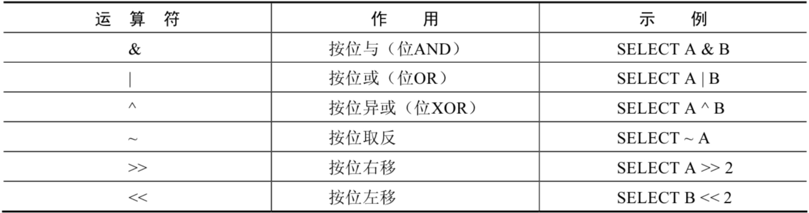
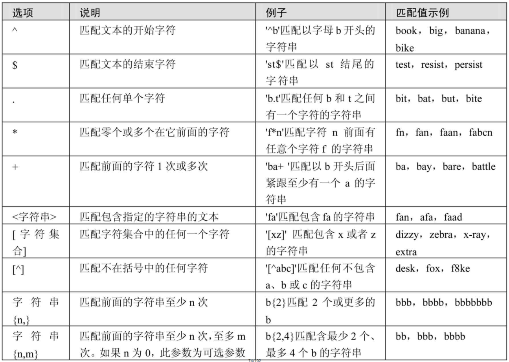
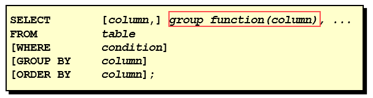
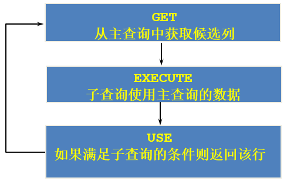

0x00 数据库概述

## 持久化(persistence)

​	**把数据保存到可掉电式存储设备中以供之后使用**。

​	**将内存中的数据存储在关系型数据库中**，存储在磁盘文件、XML数据文件中。

## 相关概念

| **DB：数据库（Database）**                                   |
| ------------------------------------------------------------ |
| 即存储数据的“仓库”，其本质是一个文件系统。它保存了一系列有组织的数据。 |
| **DBMS：数据库管理系统（Database Management System）**       |
| 是一种操纵和管理数据库的大型软件，用于建立、使用和维护数据库，对数据库进行统一管理和控制。用户通过数据库管理系统访问数据库中表内的数据。 |
| **SQL：结构化查询语言（Structured Query Language）**         |
| 专门用来与数据库通信的语言。                                 |

## 关系型数据库(RDBMS)

这种类型的数据库是`最古老`的数据库类型，关系型数据库模型是把复杂的数据结构归结为简单的`二元关系`（即二维表格）。

- 关系型数据库以`行(row)`和`列(column)`的形式存储数据，以便于用户理解。这一系列的行和列被称为`表(table)`，一组表组成了一个库(database)。

- 表与表之间的数据记录有关系(relationship)。现实世界中的各种实体以及实体之间的各种联系均用`关系模型`来表示。关系型数据库，就是建立在`关系模型`基础上的数据库。

- SQL 就是关系型数据库的查询语言。

- **复杂查询**：可以用SQL语句方便的在一个表以及多个表之间做非常复杂的数据查询。
- **事务支持**：使得对于安全性能很高的数据访问要求得以实现。

## 非关系型数据库(非RDBMS)

可看成传统关系型数据库的功能`阉割版本`，基于键值对存储数据，不需要经过SQL层的解析，`性能非常高`。同时，通过减少不常用的功能，进一步提高性能。

目前基本上大部分主流的非关系型数据库都是免费的。

相比于 SQL，NoSQL 泛指非关系型数据库，包括了榜单上的键值型数据库、文档型数据库、搜索引擎和列存储等，除此以外还包括图形数据库。也只有用 NoSQL 一词才能将这些技术囊括进来。

**键值型数据库**：键值型数据库通过 Key-Value 键值的方式来存储数据，其中 Key 和 Value 可以是简单的对象，也可以是复杂的对象。Key 作为唯一的标识符，优点是查找速度快，在这方面明显优于关系型数据库，缺点是无法像关系型数据库一样使用条件过滤（比如 WHERE），如果你不知道去哪里找数据，就要遍历所有的键，这就会消耗大量的计算。

键值型数据库典型的使用场景是作为`内存缓存`。`Redis `是最流行的键值型数据库。

**文档型数据库**：此类数据库可存放并获取文档，可以是XML、JSON等格式。在数据库中文档作为处理信息的基本单位，一个文档就相当于一条记录。文档数据库所存放的文档，就相当于键值数据库所存放的“值”。MongoDB 是最流行的文档型数据库。此外，还有CouchDB等。

**搜索引擎数据库**：虽然关系型数据库采用了索引提升检索效率，但是针对全文索引效率却较低。搜索引擎数据库是应用在搜索引擎领域的数据存储形式，由于搜索引擎会爬取大量的数据，并以特定的格式进行存储，这样在检索的时候才能保证性能最优。核心原理是“倒排索引”。*典型产品：Solr、Elasticsearch、Splunk 等*。

**列式数据库**：是相对于行式存储的数据库，Oracle、MySQL、SQL Server 等数据库都是采用的行式存储（Row-based），而列式数据库是将数据按照列存储到数据库中，这样做的好处是可以大量降低系统的 I/O，适合于分布式文件系统，不足在于功能相对有限。典型产品：HBase等。

**图形数据库**：利用了图这种数据结构存储了实体（对象）之间的关系。图形数据库最典型的例子就是社交网络中人与人的关系，数据模型主要是以节点和边（关系）来实现，特点在于能高效地解决复杂的关系问题。*典型产品：Neo4J、InfoGrid等。*

## 常见的数据库

**Oracle**

1979 年，Oracle 2 诞生，它是第一个商用的 RDBMS（关系型数据库管理系统）。随着 Oracle 软件的名气越来越大，公司也改名叫 Oracle 公司。

2009年，总计74亿美金收购SUN。此前的2008年，SUN以10亿美金收购MySQL。意味着Oracle 同时拥有了 MySQL 的管理权，至此 Oracle 在数据库领域中成为绝对的领导者。

**SQL Server**

SQL Server 是微软开发的大型商业数据库，诞生于 1989 年。C#、.net等语言常使用，与WinNT完全集成，也可以很好地与Microsoft BackOffice产品集成。

**DB2**

IBM公司的数据库产品,收费的。常应用在银行系统中。

**PostgreSQL**

PostgreSQL 的稳定性极强，最符合SQL标准，开放源码，具备商业级DBMS质量。PG对数据量大的文本以及SQL处理较快。

**SyBase**

已经淡出历史舞台。提供了一个非常专业数据建模的工具PowerDesigner。 

**SQLite**

嵌入式的小型数据库，应用在手机端。 零配置，SQlite3不用安装，不用配置，不用启动，关闭或者配置数据库实例。当系统崩溃后不用做任何恢复操作，再下次使用数据库的时候自动恢复。

**informix**

IBM公司出品，取自Information 和Unix的结合，它是第一个被移植到Linux上的商业数据库产品。仅运行于unix/linux平台，命令行操作。 性能较高，支持集群，适应于安全性要求极高的系统，尤其是银行，证券系统的应用。  

## MySQL

- MySQL是一个`开放源代码的关系型数据库管理系统`，由瑞典MySQL AB（创始人Michael Widenius）公司1995年开发，迅速成为开源数据库的 No.1。
- 2008被`Sun`收购（10亿美金），2009年Sun被`Oracle`收购。`MariaDB`应运而生。（MySQL 的创造者担心 MySQL 有闭源的风险，因此创建了 MySQL 的分支项目 MariaDB）
- MySQL6.x 版本之后分为`社区版`和`商业版`。
- MySQL支持大型数据库，支持5000万条记录的数据仓库，32位系统表文件最大可支持`4GB`，64位系统支持最大的表文件为`8TB`。
- MySQL使用`标准的SQL数据语言`形式。
- MySQL可以允许运行于多个系统上，并且支持多种语言。这些编程语言包括C、C++、Python、Java、Perl、PHP和Ruby等。

## Oracle vs MySQL

Oracle 更适合大型跨国企业的使用，因为他们对费用不敏感，但是对性能要求以及安全性有更高的要求。

MySQL 由于其**体积小、速度快、总体拥有成本低，可处理上千万条记录的大型数据库，尤其是开放源码这一特点，使得很多互联网公司、中小型网站选择了MySQL作为网站数据库**（Facebook，Twitter，YouTube，阿里巴巴/蚂蚁金服，去哪儿，美团外卖，腾讯）。

## RDBMS 与 非RDBMS

从排名中我们能看出来，关系型数据库绝对是 DBMS 的主流，其中使用最多的 DBMS 分别是 Oracle、MySQL 和 SQL Server。这些都是关系型数据库（RDBMS）。

## 关系型数据库设计规则

- E-R（entity-relationship，实体-联系）模型中有三个主要概念是：`实体集`、`属性`、`联系集`。

- 一个实体集（class）对应于数据库中的一个表（table），一个实体（instance）则对应于数据库表中的一行（row），也称为一条记录（record）。一个属性（attribute）对应于数据库表中的一列（column），也称为一个字段（field）。


```
ORM思想 (Object Relational Mapping)体现：
数据库中的一个表  <---> Java或Python中的一个类
表中的一条数据  <---> 类中的一个对象（或实体）
表中的一个列  <----> 类中的一个字段、属性(field)
```

## 表的关联关系

【多表查询和子查询那里有用】

- 表与表之间的数据记录有关系(relationship)。现实世界中的各种实体以及实体之间的各种联系均用关系模型来表示。
- 四种：一对一关联、一对多关联、多对多关联、自我引用

### 一对一关联（one-to-one）

- 在实际的开发中应用不多，因为一对一可以创建成一张表。
- 举例：设计`学生表`：学号、姓名、手机号码、班级、系别、身份证号码、家庭住址、籍贯、紧急联系人、...
  - 拆为两个表：两个表的记录是一一对应关系。

  - `基础信息表`（常用信息）：学号、姓名、手机号码、班级、系别
  - `档案信息表`（不常用信息）：学号、身份证号码、家庭住址、籍贯、紧急联系人、...
- 两种建表原则： 
  - 外键唯一：主表的主键和从表的外键（唯一），形成主外键关系，外键唯一。 
  - 外键是主键：主表的主键和从表的主键，形成主外键关系。


### 一对多关系（one-to-many）

- 常见实例场景：`客户表和订单表`，`分类表和商品表`，`部门表和员工表`。
- 举例：
  - 员工表：编号、姓名、...、所属部门

  - 部门表：编号、名称、简介
- 一对多建表原则：在从表(多方)创建一个字段，字段作为外键指向主表(一方)的主键


### 多对多（many-to-many）

要表示多对多关系，必须创建第三个表，该表通常称为`联接表`，它将多对多关系划分为两个一对多关系。将这两个表的主键都插入到第三个表中。


### 自我引用(Self reference)

# 0x01 初识Mysql

## 数据库安装

下载和安装 Mysql 5.7和8.0：注意端口设置、环境变量设置

启动MySQL服务

```shell
#也可使用windows图形化管理工具，开启关闭服务
# 启动 MySQL 服务命令：
net start MySQL服务名

# 停止 MySQL 服务命令：
net stop MySQL服务名
```

## 目录结构

| MySQL的目录结构                             | 说明                                 |
| ------------------------------------------- | ------------------------------------ |
| bin目录                                     | 所有MySQL的可执行文件。如：mysql.exe |
| MySQLInstanceConfig.exe                     | 数据库的配置向导，在安装时出现的内容 |
| data目录                                    | 系统数据库所在的目录                 |
| my.ini文件                                  | MySQL的主要配置文件                  |
| c:\ProgramData\MySQL\MySQL Server 8.0\data\ | 用户创建的数据库所在的目录           |

## 数据库使用

### 命令行

进入

```shell
mysql -u root -h localhost -P 3306 -p
# 其中MySQL_8.0.28 端口为2206 ，MySQL_5.7.37 端口为 3308。端口为大写的-P
```

退出

```shell
exit 或 quit
```

### GUI

Navicat、SQLyog

## 数据库编码设置

### 问题1

问题描述：5.7版本出现 ERROR 1366 (HY000): Incorrect string value:

在C:\ProgramData\MySQL\MySQL Server 5.7\my.ini中配置
	[mysql] 下 ：default-character-set=utf8mb4
	[mysqld]下 ：character-set-server=utf8  collation-server=utf8_general_ci
注意：若character-set-server=utf8mb4则会无法启动mysql

重启mysql57
	服务服务管理 or 命令行（mysql server restart 这是重启的环境变量里的那个吧）

### 问题2

问题描述：设置数据库编码后，原先创建的数据库依旧不支持新设置的编码，还是ERROR 1366。

解决方案：

```sql
-- Change a database
ALTER DATABASE [database_name] 
  CHARACTER SET = utf8mb4 COLLATE = utf8mb4_unicode_ci; 

-- Change a table
ALTER TABLE [table_name] 
  CONVERT TO CHARACTER SET utf8mb4 COLLATE utf8mb4_unicode_ci; 

-- Change a column
ALTER TABLE [table_name] 
  CHANGE [column_name] [column_name] VARCHAR(255) 
  CHARACTER SET utf8mb4 COLLATE utf8mb4_unicode_ci;
```

参考链接：https://sebhastian.com/mysql-incorrect-string-value/

## 数据库初操

```sql
show DATABASES;	#显示当前已有的数据库
create DATABASE filwsx;	#创建filwsx数据库
show DATABASES;
use filwsx;	#切换到数据库filwsx
create table person(id int,name varchar(15));	#为数据库创建一张person表，指定表格数据格式
show tables;
insert into person VALUES(1001,'filwsx');	#为表格添加一条数据
insert into person VALUES(1002,'Tom');
insert into person VALUES(1003,'Jerry');
select * from person;	#显示表格全部内容
insert into person VALUES(1004,'钱德勒');
show create table person;
show variables like 'character_%';
show variables like 'collation_%';
exit;
```

# 0x02 SQL概述

- 1974 年，IBM 研究员发布了一篇揭开数据库技术的论文《SEQUEL：一门结构化的英语查询语言》，直到今天这门结构化的查询语言并没有太大的变化，相比于其他语言，`SQL 的半衰期可以说是非常长`了。
- 不论是前端工程师，还是后端算法工程师，都一定会和数据打交道，都需要了解如何又快又准确地提取自己想要的数据。
- SQL（Structured Query Language，结构化查询语言）是使用关系模型的数据库应用语言，`与数据直接打交道`，由`IBM`上世纪70年代开发出来。后由美国国家标准局（ANSI）开始着手制定SQL标准，先后有`SQL-86`，`SQL-89`，`SQL-92`，`SQL-99`等标准。
  - SQL 有两个重要的标准，分别是 SQL92 和 SQL99，它们分别代表了 92 年和 99 年颁布的 SQL 标准，我们今天使用的 SQL 语言依然遵循这些标准。
- 不同的数据库生产厂商都支持SQL语句，但都有特有内容。


## SQL 分类

SQL语言在功能上主要分为如下3大类：

- **DDL（Data Definition Languages、数据定义语言）**，这些语句定义了不同的数据库、表、视图、索引等数据库对象，还可以用来创建、删除、修改数据库和数据表的结构。
  - 主要的语句关键字包括`CREATE`、`DROP`、`ALTER`等。

- **DML（Data Manipulation Language、数据操作语言）**，用于添加、删除、更新和查询数据库记录，并检查数据完整性。
  - 主要的语句关键字包括`INSERT`、`DELETE`、`UPDATE`、`SELECT`等。
  - **SELECT是SQL语言的基础，最为重要。**

- **DCL（Data Control Language、数据控制语言）**，用于定义数据库、表、字段、用户的访问权限和安全级别。
  - 主要的语句关键字包括`GRANT`、`REVOKE`、`COMMIT`、`ROLLBACK`、`SAVEPOINT`等。

> 因为查询语句使用的非常的频繁，所以很多人把查询语句单拎出来一类：DQL（数据查询语言）。
>
> 还有单独将`COMMIT`、`ROLLBACK` 取出来称为TCL （Transaction Control Language，事务控制语言）。

## SQL语言的规则与规范

### 基本规则

- SQL 可以写在一行或者多行。为了提高可读性，各子句分行写，必要时使用缩进
- 每条命令以 ; 或 \g 或 \G 结束
- 关键字不能被缩写也不能分行
- 关于标点符号
  - 必须保证所有的()、单引号、双引号是成对结束的
  - 必须使用英文状态下的半角输入方式
  - 字符串型和日期时间类型的数据可以使用单引号（' '）表示
  - 列的别名，尽量使用双引号（" "），而且不建议省略as

### 大小写规范 （遵守）

MySQL大小写是否敏感是遵从操作系统的

- **MySQL 在 Windows 环境下是大小写不敏感的**
- **MySQL 在 Linux 环境下是大小写敏感的**
  - 数据库名、表名、表的别名、变量名是严格区分大小写的
  - 关键字、函数名、列名(或字段名)、列的别名(字段的别名) 是忽略大小写的。
- **推荐采用统一的书写规范：**
  - 数据库名、表名、表别名、字段名、字段别名等都小写
  - SQL 关键字、函数名、绑定变量等都大写

### 注 释

可以使用如下格式的注释结构

```mysql
单行注释：#注释文字(MySQL特有的方式)
单行注释：-- 注释文字(--后面必须包含一个空格。)
多行注释：/* 注释文字  */
```

###  标识符命名规则

- 数据库、表名不得超过30个字符，变量名限制为29个
- 必须只能包含 A–Z, a–z, 0–9, _共63个字符
- 数据库名、表名、字段名等对象名中间不要包含空格
- 同一个MySQL软件中，数据库不能同名；同一个库中，表不能重名；同一个表中，字段不能重名
- 必须保证你的字段没有和保留字、数据库系统或常用方法冲突。如果坚持使用，请在SQL语句中使用`（着重号）引起来
- 保持字段名和类型的一致性，在命名字段并为其指定数据类型的时候一定要保证一致性。假如数据类型在一个表里是整数，那在另一个表里可就别变成字符型了

# 0x03 SELECT语句

## SELECT ... FROM

- 语法：

```mysql
SELECT   [标识选择哪些列]
FROM     [标识从哪个表中选择]
```

- 选择全部列：

```mysql
SELECT *
FROM   departments;
```

## 列的别名

作用：重命名一个列、便于计算、见名知意

使用：紧跟列名，也可**在列名和别名之间加入关键字AS**，**别名使用双引号**用于别名中包含空格、特殊字符、大小写。AS 可以省略

## 去除重复行

```mysql
SELECT department_id
FROM   employees;
```

## 空值参与运算

所有运算符或列值遇到null值，运算的结果都为null

## 着重号

我们需要保证表中的字段、表名等没有和保留字、数据库系统或常用方法冲突。

如果相同，请在SQL语句中使用一对``（着重号）引起来。

## 查询常数

略？

## 显示表结构

```mysql
DESCRIBE employees;
# 或
DESC employees;
```

## 过滤数据

```mysql
SELECT 字段1,字段2
FROM 表名
WHERE 过滤条件
```

- 使用WHERE 子句，将不满足条件的行过滤掉
- **WHERE子句紧随 FROM子句**

# 0x04 运算符

## 算术运算符

算术运算符主要用于数学运算，其可以连接运算符前后的两个数值或表达式，对数值或表达式进行加（+）、减（-）、乘（*）、除（/）和取模（%）运算。


**1．加法与减法运算符**

由运算结果可以得出如下结论：

> - 一个整数类型的值对整数进行加法和减法操作，结果还是一个整数；
> - 一个整数类型的值对浮点数进行加法和减法操作，结果是一个浮点数；
> - 加法和减法的优先级相同，进行先加后减操作与进行先减后加操作的结果是一样的；
> - 在Java中，+的左右两边如果有字符串，那么表示字符串的拼接。但是在MySQL中+只表示数值相加。如果遇到非数值类型，先尝试转成数值，如果转失败，就按0计算。（补充：MySQL中字符串拼接要使用字符串函数CONCAT()实现）

**2．乘法与除法运算符**

> - 一个数乘以整数1和除以整数1后仍得原数；
> - 一个数乘以浮点数1和除以浮点数1后变成浮点数，数值与原数相等；
> - 一个数除以整数后，不管是否能除尽，结果都为一个浮点数；
> - 一个数除以另一个数，除不尽时，结果为一个浮点数，并保留到小数点后4位；
> - 乘法和除法的优先级相同，进行先乘后除操作与先除后乘操作，得出的结果相同。
> - 在数学运算中，0不能用作除数，在MySQL中，一个数除以0为NULL。

## 比较运算符

比较运算符用来对表达式左边的操作数和右边的操作数进行比较，比较的结果为真则返回1，比较的结果为假则返回0，其他情况则返回NULL。

比较运算符经常被用来作为SELECT查询语句的条件来使用，返回符合条件的结果记录。


**1．等号运算符**

- 等号运算符（=）判断等号两边的值、字符串或表达式是否相等，如果相等则返回1，不相等则返回0。

- 在使用等号运算符时，遵循如下规则：
  - 如果等号两边的值、字符串或表达式都为字符串，则MySQL会按照字符串进行比较，其比较的是每个字符串中字符的ANSI编码是否相等。
  - 如果等号两边的值都是整数，则MySQL会按照整数来比较两个值的大小。
  - 如果等号两边的值一个是整数，另一个是字符串，则MySQL会将字符串转化为数字进行比较。
  - 如果等号两边的值、字符串或表达式中有一个为NULL，则比较结果为NULL。

- 对比：SQL中赋值符号使用 := 

```mysql
mysql> SELECT 1 = 1, 1 = '1', 1 = 0, 'a' = 'a', (5 + 3) = (2 + 6), '' = NULL , NULL = NULL; 
+-------+---------+-------+-----------+-------------------+-----------+-------------+
| 1 = 1 | 1 = '1' | 1 = 0 | 'a' = 'a' | (5 + 3) = (2 + 6) | '' = NULL | NULL = NULL |
+-------+---------+-------+-----------+-------------------+-----------+-------------+
|    1  |     1   |   0   |      1    |             1     |    NULL   |        NULL  |
+-------+---------+-------+-----------+-------------------+-----------+-------------+
1 row in set (0.00 sec)
```

```mysql
mysql> SELECT 1 = 2, 0 = 'abc', 1 = 'abc' FROM dual;
+-------+-----------+-----------+
| 1 = 2 | 0 = 'abc' | 1 = 'abc' |
+-------+-----------+-----------+
|     0 |         1 |         0 |
+-------+-----------+-----------+
1 row in set, 2 warnings (0.00 sec)
```

```mysql
#查询salary=10000，注意在Java中比较是==
SELECT employee_id,salary FROM employees WHERE salary = 10000;
```

**2．安全等于运算符**
安全等于运算符（<=>）与等于运算符（=）的作用是相似的，`唯一的区别`是‘<=>’可以用来对NULL进行判断。在两个操作数均为NULL时，其返回值为1，而不为NULL；当一个操作数为NULL时，其返回值为0，而不为NULL。

```mysql
mysql> SELECT 1 <=> '1', 1 <=> 0, 'a' <=> 'a', (5 + 3) <=> (2 + 6), '' <=> NULL,NULL <=> NULL FROM dual;
+-----------+---------+-------------+---------------------+-------------+---------------+
| 1 <=> '1' | 1 <=> 0 | 'a' <=> 'a' | (5 + 3) <=> (2 + 6) | '' <=> NULL | NULL <=> NULL |
+-----------+---------+-------------+---------------------+-------------+---------------+
|         1 |       0 |           1 |                   1 |           0 |             1 |
+-----------+---------+-------------+---------------------+-------------+---------------+
1 row in set (0.00 sec)
```

```mysql
#查询commission_pct等于0.40
SELECT employee_id,commission_pct FROM employees WHERE commission_pct = 0.40;

SELECT employee_id,commission_pct FROM employees WHERE commission_pct <=> 0.40;

#如果把0.40改成 NULL 呢？
```

可以看到，使用安全等于运算符时，两边的操作数的值都为NULL时，返回的结果为1而不是NULL，其他返回结果与等于运算符相同。

**3．不等于运算符**
不等于运算符（<>和!=）用于判断两边的数字、字符串或者表达式的值是否不相等，如果不相等则返回1，相等则返回0。不等于运算符不能判断NULL值。如果两边的值有任意一个为NULL，或两边都为NULL，则结果为NULL。
SQL语句示例如下：

```mysql
mysql> SELECT 1 <> 1, 1 != 2, 'a' != 'b', (3+4) <> (2+6), 'a' != NULL, NULL <> NULL; 
+--------+--------+------------+----------------+-------------+--------------+
| 1 <> 1 | 1 != 2 | 'a' != 'b' | (3+4) <> (2+6) | 'a' != NULL | NULL <> NULL |
+--------+--------+------------+----------------+-------------+--------------+
|      0 |   1    |       1    |            1   |     NULL    |         NULL |
+--------+--------+------------+----------------+-------------+--------------+
1 row in set (0.00 sec)
```

此外，还有非符号类型的运算符：


**4. 空运算符**
空运算符（IS NULL或者ISNULL）判断一个值是否为NULL，如果为NULL则返回1，否则返回0。

**5. 非空运算符**
非空运算符（IS NOT NULL）判断一个值是否不为NULL，如果不为NULL则返回1，否则返回0。

**6. 最小值运算符**
当参数是整数或者浮点数时，LEAST将返回其中最小的值；当参数为字符串时，返回字母表中顺序最靠前的字符；当比较值列表中有NULL时，不能判断大小，返回值为NULL。

**7. 最大值运算符**
语法格式为：GREATEST(值1，值2，...，值n)。其中，n表示参数列表中有n个值。当有两个或多个参数时，返回值为最大值。假如任意一个自变量为NULL，则GREATEST()的返回值为NULL。

当参数中是整数或者浮点数时，GREATEST将返回其中最大的值；当参数为字符串时，返回字母表中顺序最靠后的字符；当比较值列表中有NULL时，不能判断大小，返回值为NULL。

**8. BETWEEN AND运算符**
BETWEEN运算符使用的格式通常为SELECT D FROM TABLE WHERE C BETWEEN A AND B，此时，当C大于或等于A，并且C小于或等于B时，结果为1，否则结果为0。

**9. IN运算符**
IN运算符用于判断给定的值是否是IN列表中的一个值，如果是则返回1，否则返回0。如果给定的值为NULL，或者IN列表中存在NULL，则结果为NULL。

**10. NOT IN运算符**
NOT IN运算符用于判断给定的值是否不是IN列表中的一个值，如果不是IN列表中的一个值，则返回1，否则返回0。

**11. LIKE运算符**
LIKE运算符主要用来匹配字符串，通常用于模糊匹配，如果满足条件则返回1，否则返回0。如果给定的值或者匹配条件为NULL，则返回结果为NULL。

LIKE运算符通常使用如下通配符：

```mysql
“%”：匹配0个或多个字符。
“_”：只能匹配一个字符。
```

**ESCAPE**

- 回避特殊符号的：**使用转义符**。例如：将[%]转为[$%]、[]转为[$]，然后再加上[ESCAPE‘$’]即可。

- 如果使用\表示转义，要省略ESCAPE。如果不是\，则要加上ESCAPE。

## 逻辑运算符

逻辑运算符主要用来判断表达式的真假，在MySQL中，逻辑运算符的返回结果为1、0或者NULL。

MySQL中支持4种逻辑运算符如下：


**1．逻辑非运算符**
逻辑非（NOT或!）运算符表示当给定的值为0时返回1；当给定的值为非0值时返回0；当给定的值为NULL时，返回NULL。

**2．逻辑与运算符**
逻辑与（AND或&&）运算符是当给定的所有值均为非0值，并且都不为NULL时，返回1；当给定的一个值或者多个值为0时则返回0；否则返回NULL。

**3．逻辑或运算符**
逻辑或（OR或||）运算符是当给定的值都不为NULL，并且任何一个值为非0值时，则返回1，否则返回0；当一个值为NULL，并且另一个值为非0值时，返回1，否则返回NULL；当两个值都为NULL时，返回NULL。

> 注意：
>
> OR可以和AND一起使用，但是在使用时要注意两者的优先级，由于AND的优先级高于OR，因此先对AND两边的操作数进行操作，再与OR中的操作数结合。

**4．逻辑异或运算符**
逻辑异或（XOR）运算符是当给定的值中任意一个值为NULL时，则返回NULL；如果两个非NULL的值都是0或者都不等于0时，则返回0；如果一个值为0，另一个值不为0时，则返回1。

## 位运算符

位运算符是在二进制数上进行计算的运算符。位运算符会先将操作数变成二进制数，然后进行位运算，最后将计算结果从二进制变回十进制数。

MySQL支持的位运算符如下：



**1．按位与运算符**
按位与（&）运算符将给定值对应的二进制数逐位进行逻辑与运算。当给定值对应的二进制位的数值都为1时，则该位返回1，否则返回0。

1的二进制数为0001，10的二进制数为1010，所以1 & 10的结果为0000，对应的十进制数为0。20的二进制数为10100，30的二进制数为11110，所以20 & 30的结果为10100，对应的十进制数为20。

**2. 按位或运算符**
按位或（|）运算符将给定的值对应的二进制数逐位进行逻辑或运算。当给定值对应的二进制位的数值有一个或两个为1时，则该位返回1，否则返回0。

1的二进制数为0001，10的二进制数为1010，所以1 | 10的结果为1011，对应的十进制数为11。20的二进制数为10100，30的二进制数为11110，所以20 | 30的结果为11110，对应的十进制数为30。

**3. 按位异或运算符**
按位异或（^）运算符将给定的值对应的二进制数逐位进行逻辑异或运算。当给定值对应的二进制位的数值不同时，则该位返回1，否则返回0。

1的二进制数为0001，10的二进制数为1010，所以1 ^ 10的结果为1011，对应的十进制数为11。20的二进制数为10100，30的二进制数为11110，所以20 ^ 30的结果为01010，对应的十进制数为10。

再举例：


**4. 按位取反运算符**
按位取反（~）运算符将给定的值的二进制数逐位进行取反操作，即将1变为0，将0变为1。

由于按位取反（~）运算符的优先级高于按位与（&）运算符的优先级，所以10 & ~1，首先，对数字1进行按位取反操作，结果除了最低位为0，其他位都为1，然后与10进行按位与操作，结果为10。

**5. 按位右移运算符**
按位右移（>>）运算符将给定的值的二进制数的所有位右移指定的位数。右移指定的位数后，右边低位的数值被移出并丢弃，左边高位空出的位置用0补齐。

1的二进制数为0000 0001，右移2位为0000 0000，对应的十进制数为0。4的二进制数为0000 0100，右移2位为0000 0001，对应的十进制数为1。

**6. 按位左移运算符**
按位左移（<<）运算符将给定的值的二进制数的所有位左移指定的位数。左移指定的位数后，左边高位的数值被移出并丢弃，右边低位空出的位置用0补齐。

1的二进制数为0000 0001，左移两位为0000 0100，对应的十进制数为4。4的二进制数为0000 0100，左移两位为0001 0000，对应的十进制数为16。

## 运算符的优先级


数字编号越大，优先级越高，优先级高的运算符先进行计算。可以看到，赋值运算符的优先级最低，使用“()”括起来的表达式的优先级最高。

## 正则表达式查询

**REGEXP运算符**

REGEXP运算符用来匹配字符串，语法格式为：`expr REGEXP 匹配条件`。如果expr满足匹配条件，返回1；如果不满足，则返回0。若expr或匹配条件任意一个为NULL，则结果为NULL。

REGEXP运算符在进行匹配时，常用的有下面几种通配符：

```
（1）‘^’匹配以该字符后面的字符开头的字符串。
（2）‘$’匹配以该字符前面的字符结尾的字符串。
（3）‘.’匹配任何一个单字符。
（4）“[...]”匹配在方括号内的任何字符。例如，“[abc]”匹配“a”或“b”或“c”。为了命名字符的范围，使用一个‘-’。“[a-z]”匹配任何字母，而“[0-9]”匹配任何数字。
（5）‘*’匹配零个或多个在它前面的字符。例如，“x*”匹配任何数量的‘x’字符，“[0-9]*”匹配任何数量的数字，而“*”匹配任何数量的任何字符。
```

正则表达式通常被用来检索或替换那些符合某个模式的文本内容，根据指定的匹配模式匹配文本中符合要求的特殊字符串。例如，从一个文本文件中提取电话号码，查找一篇文章中重复的单词或者替换用户输入的某些敏感词语等，这些地方都可以使用正则表达式。正则表达式强大而且灵活，可以应用于非常复杂的查询。

MySQL中使用REGEXP关键字指定正则表达式的字符匹配模式。下表列出了REGEXP操作符中常用字符匹配列表。



**1. 查询以特定字符或字符串开头的记录**
字符‘^’匹配以特定字符或者字符串开头的文本。

在fruits表中，查询f_name字段以字母‘b’开头的记录，SQL语句如下：

```mysql
mysql> SELECT * FROM fruits WHERE f_name REGEXP '^b';
```

**2. 查询以特定字符或字符串结尾的记录**
字符‘$’匹配以特定字符或者字符串结尾的文本。

在fruits表中，查询f_name字段以字母‘y’结尾的记录，SQL语句如下：

```mysql
mysql> SELECT * FROM fruits WHERE f_name REGEXP 'y$';
```

**3. 用符号"."来替代字符串中的任意一个字符**
字符‘.’匹配任意一个字符。
在fruits表中，查询f_name字段值包含字母‘a’与‘g’且两个字母之间只有一个字母的记录，SQL语句如下：

```mysql
mysql> SELECT * FROM fruits WHERE f_name REGEXP 'a.g';
```

**4. 使用"*"和"+"来匹配多个字符**
星号‘*’匹配前面的字符任意多次，包括0次。加号‘+’匹配前面的字符至少一次。

在fruits表中，查询f_name字段值以字母‘b’开头且‘b’后面出现字母‘a’的记录，SQL语句如下：

```mysql
mysql> SELECT * FROM fruits WHERE f_name REGEXP '^ba*';
```

在fruits表中，查询f_name字段值以字母‘b’开头且‘b’后面出现字母‘a’至少一次的记录，SQL语句如下：

```mysql
mysql> SELECT * FROM fruits WHERE f_name REGEXP '^ba+';
```

**5. 匹配指定字符串**
正则表达式可以匹配指定字符串，只要这个字符串在查询文本中即可，如要匹配多个字符串，多个字符串之间使用分隔符‘|’隔开。

在fruits表中，查询f_name字段值包含字符串“on”的记录，SQL语句如下：

```mysql
mysql> SELECT * FROM fruits WHERE f_name REGEXP 'on';
```

在fruits表中，查询f_name字段值包含字符串“on”或者“ap”的记录，SQL语句如下：

```mysql
mysql> SELECT * FROM fruits WHERE f_name REGEXP 'on|ap';
```

之前介绍过，LIKE运算符也可以匹配指定的字符串，但与REGEXP不同，LIKE匹配的字符串如果在文本中间出现，则找不到它，相应的行也不会返回。REGEXP在文本内进行匹配，如果被匹配的字符串在文本中出现，REGEXP将会找到它，相应的行也会被返回。对比结果如下所示。

在fruits表中，使用LIKE运算符查询f_name字段值为“on”的记录，SQL语句如下：

```mysql
mysql> SELECT * FROM fruits WHERE f_name like 'on';
Empty set(0.00 sec)
```

**6. 匹配指定字符中的任意一个**
方括号“[]”指定一个字符集合，只匹配其中任何一个字符，即为所查找的文本。

在fruits表中，查找f_name字段中包含字母‘o’或者‘t’的记录，SQL语句如下：

```mysql
mysql> SELECT * FROM fruits WHERE f_name REGEXP '[ot]';
```

在fruits表中，查询s_id字段中包含4、5或者6的记录，SQL语句如下：

```mysql
mysql> SELECT * FROM fruits WHERE s_id REGEXP '[456]';
```

**7. 匹配指定字符以外的字符**
`“[^字符集合]”`匹配不在指定集合中的任何字符。

在fruits表中，查询f_id字段中包含字母a~e和数字1~2以外字符的记录，SQL语句如下：

```mysql
mysql> SELECT * FROM fruits WHERE f_id REGEXP '[^a-e1-2]';
```

**8. 使用{n,}或者{n,m}来指定字符串连续出现的次数**
“字符串{n,}”表示至少匹配n次前面的字符；“字符串{n,m}”表示匹配前面的字符串不少于n次，不多于m次。例如，a{2,}表示字母a连续出现至少2次，也可以大于2次；a{2,4}表示字母a连续出现最少2次，最多不能超过4次。

在fruits表中，查询f_name字段值出现字母‘x’至少2次的记录，SQL语句如下：

```mysql
mysql> SELECT * FROM fruits WHERE f_name REGEXP 'x{2,}';
```

在fruits表中，查询f_name字段值出现字符串“ba”最少1次、最多3次的记录，SQL语句如下：

```mysql
mysql> SELECT * FROM fruits WHERE f_name REGEXP 'ba{1,3}';
```

# 0x05 排序与分页

## 排序数据

- 使用 ORDER BY 子句排序
  - **ASC（ascend）: 升序**
  - **DESC（descend）:降序**
- **ORDER BY 子句在SELECT语句的结尾。**

### 单列排序

```mysql
SELECT   last_name, job_id, department_id, hire_date
FROM     employees
ORDER BY hire_date ;
```

```mysql
SELECT   last_name, job_id, department_id, hire_date
FROM     employees
ORDER BY hire_date DESC ;
```

### 多列排序

```mysql
SELECT last_name, department_id, salary
FROM   employees
ORDER BY department_id, salary DESC;
```

- 可以使用不在SELECT列表中的列排序。
- 在对多列进行排序的时候，首先排序的第一列必须有相同的列值，才会对第二列进行排序。如果第一列数据中所有值都是唯一的，将不再对第二列进行排序。

## 分页

背景1：查询返回的记录太多了，查看起来很不方便，怎么样能够实现分页查询呢？

背景2：表里有 4 条数据，我们只想要显示第 2、3 条数据怎么办呢？

- 分页原理：所谓分页显示，就是将数据库中的结果集，一段一段显示出来需要的条件。

- **MySQL中使用 LIMIT 实现分页**

- 格式：

  ```mysql
  LIMIT [位置偏移量,] 行数
  ```

  第一个“位置偏移量”参数指示MySQL从哪一行开始显示，是一个可选参数，如果不指定“位置偏移量”，将会从表中的第一条记录开始（第一条记录的位置偏移量是0，第二条记录的位置偏移量是1，以此类推）；第二个参数“行数”指示返回的记录条数。

- 举例

```mysql
--前10条记录：
SELECT * FROM 表名 LIMIT 0,10;
或者
SELECT * FROM 表名 LIMIT 10;

--第11至20条记录：
SELECT * FROM 表名 LIMIT 10,10;

--第21至30条记录： 
SELECT * FROM 表名 LIMIT 20,10;
```

> MySQL 8.0中可以使用“LIMIT 3 OFFSET 4”，意思是获取从第5条记录开始后面的3条记录，和“LIMIT 4,3;”返回的结果相同。

- 分页显式公式**：（当前页数-1）*每页条数，每页条数**

```mysql
SELECT * FROM table 
LIMIT(PageNo - 1)*PageSize,PageSize;
```

- **注意：LIMIT 子句必须放在整个SELECT语句的最后！**
- 使用 LIMIT 的好处

约束返回结果的数量可以`减少数据表的网络传输量`，也可以`提升查询效率`。如果我们知道返回结果只有 1 条，就可以使用`LIMIT 1`，告诉 SELECT 语句只需要返回一条记录即可。这样的好处就是 SELECT 不需要扫描完整的表，只需要检索到一条符合条件的记录即可返回。

# 0x06 多表查询

多表查询，也称为关联查询，指两个或更多个表一起完成查询操作。

前提条件：这些一起查询的表之间是有关系的（一对一、一对多），它们之间一定是有关联字段，这个关联字段可能建立了外键，也可能没有建立外键。比如：员工表和部门表，这两个表依靠“部门编号”进行关联。

## 笛卡尔积（或交叉连接）的理解

笛卡尔乘积是一个数学运算。假设我有两个集合 X 和 Y，那么 X 和 Y 的笛卡尔积就是 X 和 Y 的所有可能组合，也就是第一个对象来自于 X，第二个对象来自于 Y 的所有可能。组合的个数即为两个集合中元素个数的乘积数。

【多表查询是基于笛卡尔积结果的过滤】

**产生笛卡尔积的条件**：

- 省略多个表的连接条件（或关联条件）
- 连接条件（或关联条件）无效
- 所有表中的所有行互相连接

- 为了避免笛卡尔积， 可以**在 WHERE 加入有效的连接条件。**

## 分类1：等值连接 vs 非等值连接

```mysql
SELECT employees.employee_id, employees.last_name, 
       employees.department_id, departments.department_id,
       departments.location_id
FROM   employees, departments
WHERE  employees.department_id = departments.department_id;
```

多个连接条件与 AND 操作符

区分重复的列名

- **多个表中有相同列时，必须在列名之前加上表名前缀。**
- 在不同表中具有相同列名的列可以用`表名`加以区分。

表的别名

- 使用别名可以简化查询。

- 列名前使用表名前缀可以提高查询效率。

连接多个表：连接 n个表,至少需要n-1个连接条件

## 分类2：自连接 vs 非自连接

table1和table2本质上是同一张表，只是用取别名的方式虚拟成两张表以代表不同的意义。然后两个表再进行内连接，外连接等查询。

## 分类3：内连接 vs 外连接

除了查询满足条件的记录以外，外连接还可以查询某一方不满足条件的记录。

## SQL99语法实现多表查询

### JOIN...ON

```mysql
SELECT table1.column, table2.column,table3.column
FROM table1
    JOIN table2 ON table1 和 table2 的连接条件
        JOIN table3 ON table2 和 table3 的连接条件
# 如同for 循环的嵌套
```

- SQL99 采用的这种嵌套结构非常清爽、层次性更强、可读性更强，即使再多的表进行连接也都清晰可见。如果你采用 SQL92，可读性就会大打折扣。
- 语法说明：
  - **可以使用** **ON** **子句指定额外的连接条件**。
  - 这个连接条件是与其它条件分开的。
  - **ON** **子句使语句具有更高的易读性**。
  - 关键字 JOIN、INNER JOIN、CROSS JOIN 的含义是一样的，都表示内连接

**内连接(INNER JOIN)的实现**

```mysql
SELECT 字段列表
FROM A表 INNER JOIN B表
ON 关联条件
WHERE 等其他子句;
```

**左外连接(LEFT OUTER JOIN)**

```mysql
#实现查询结果是A
SELECT 字段列表
FROM A表 LEFT JOIN B表
ON 关联条件
WHERE 等其他子句;
```

**右外连接(RIGHT OUTER JOIN)**

```mysql
#实现查询结果是B
SELECT 字段列表
FROM A表 RIGHT JOIN B表
ON 关联条件
WHERE 等其他子句;
```

**满外连接(FULL OUTER JOIN)**

- 满外连接的结果 = 左右表匹配的数据 + 左表没有匹配到的数据 + 右表没有匹配到的数据。
- SQL99是支持满外连接的。使用FULL JOIN 或 FULL OUTER JOIN来实现。
- 需要注意的是，MySQL不支持FULL JOIN，但是可以用 LEFT JOIN **UNION** RIGHT join代替。

### UNION

**合并查询结果**：UNION 操作符返回两个查询的结果集的并集，去除重复记录。

利用UNION关键字，可以给出多条SELECT语句，并将它们的结果组合成单个结果集。合并时，两个表对应的列数和数据类型必须相同，并且相互对应。各个SELECT语句之间使用UNION或UNION ALL关键字分隔。

语法格式：

```mysql
SELECT column,... FROM table1
UNION [ALL]
SELECT column,... FROM table2
```

UNION ALL操作符返回两个查询的结果集的并集。对于两个结果集的重复部分，不去重。

> 注意：执行UNION ALL语句时所需要的资源比UNION语句少。如果明确知道合并数据后的结果数据不存在重复数据，或者不需要去除重复的数据，则尽量使用UNION ALL语句，以提高数据查询的效率。

### 7种SQL JOINS的实现


- 左中图

```mysql
#实现A -  A∩B
select 字段列表
from A表 left join B表
on 关联条件
where 从表关联字段 is null and 等其他子句;
```

- 右中图

```mysql
#实现B -  A∩B
select 字段列表
from A表 right join B表
on 关联条件
where 从表关联字段 is null and 等其他子句;
```

- 左下图

```mysql
#实现查询结果是A∪B
#用左外的A，union 右外的B
select 字段列表
from A表 left join B表
on 关联条件
where 等其他子句

union 

select 字段列表
from A表 right join B表
on 关联条件
where 等其他子句;
```

- 右下图

```mysql
#实现A∪B -  A∩B  或   (A -  A∩B) ∪ （B - A∩B）
#使用左外的 (A -  A∩B)  union 右外的（B - A∩B）
select 字段列表
from A表 left join B表
on 关联条件
where 从表关联字段 is null and 等其他子句

union

select 字段列表
from A表 right join B表
on 关联条件
where 从表关联字段 is null and 等其他子句
```

# 0x07 单行函数

##  SQL 语言差异理解

我们在使用 SQL 语言的时候，不是直接和这门语言打交道，而是通过它使用不同的数据库软件，即 DBMS。**DBMS 之间的差异性很大，远大于同一个语言不同版本之间的差异。**

实际上，只有很少的函数是被 DBMS 同时支持的。

大部分 DBMS 会有自己特定的函数，这就意味着**采用 SQL 函数的代码可移植性是很差的**，因此在使用函数的时候需要特别注意。

## MySQL的内置函数分类

**单行函数**

- 操作数据对象
- 接受参数返回一个结果
- **只对一行进行变换**
- **每行返回一个结果**
- 可以嵌套
- 参数可以是一列或一个值

**聚合函数**

它是对一组数据进行汇总的函数，输入的是一组数据的集合，输出的是单个值。

## 数值函数

### 基本

| 函数                | 用法                                                         |
| ------------------- | ------------------------------------------------------------ |
| ABS(x)              | 返回x的绝对值                                                |
| SIGN(X)             | 返回X的符号。正数返回1，负数返回-1，0返回0                   |
| PI()                | 返回圆周率的值                                               |
| CEIL(x)，CEILING(x) | 返回大于或等于某个值的最小整数                               |
| FLOOR(x)            | 返回小于或等于某个值的最大整数                               |
| LEAST(e1,e2,e3…)    | 返回列表中的最小值                                           |
| GREATEST(e1,e2,e3…) | 返回列表中的最大值                                           |
| MOD(x,y)            | 返回X除以Y后的余数                                           |
| RAND()              | 返回0~1的随机值                                              |
| RAND(x)             | 返回0~1的随机值，其中x的值用作种子值，相同的X值会产生相同的随机数 |
| ROUND(x)            | 返回一个对x的值进行四舍五入后，最接近于X的整数               |
| ROUND(x,y)          | 返回一个对x的值进行四舍五入后最接近X的值，并保留到小数点后面Y位 |
| TRUNCATE(x,y)       | 返回数字x截断为y位小数的结果                                 |
| SQRT(x)             | 返回x的平方根。当X的值为负数时，返回NULL                     |

### 角度与弧度互换

| 函数       | 用法                                  |
| ---------- | ------------------------------------- |
| RADIANS(x) | 将角度转化为弧度，其中，参数x为角度值 |
| DEGREES(x) | 将弧度转化为角度，其中，参数x为弧度值 |

### 三角函数

| 函数       | 用法                                                         |
| ---------- | ------------------------------------------------------------ |
| SIN(x)     | 返回x的正弦值，其中，参数x为弧度值                           |
| ASIN(x)    | 返回x的反正弦值，即获取正弦为x的值。如果x的值不在-1到1之间，则返回NULL |
| COS(x)     | 返回x的余弦值，其中，参数x为弧度值                           |
| ACOS(x)    | 返回x的反余弦值，即获取余弦为x的值。如果x的值不在-1到1之间，则返回NULL |
| TAN(x)     | 返回x的正切值，其中，参数x为弧度值                           |
| ATAN(x)    | 返回x的反正切值，即返回正切值为x的值                         |
| ATAN2(m,n) | 返回两个参数的反正切值                                       |
| COT(x)     | 返回x的余切值，其中，X为弧度值                               |

### 指数与对数

| 函数                 | 用法                                                 |
| -------------------- | ---------------------------------------------------- |
| POW(x,y)，POWER(X,Y) | 返回x的y次方                                         |
| EXP(X)               | 返回e的X次方，其中e是一个常数，2.718281828459045     |
| LN(X)，LOG(X)        | 返回以e为底的X的对数，当X <= 0 时，返回的结果为NULL  |
| LOG10(X)             | 返回以10为底的X的对数，当X <= 0 时，返回的结果为NULL |
| LOG2(X)              | 返回以2为底的X的对数，当X <= 0 时，返回NULL          |


### 进制转换

| 函数          | 用法                     |
| ------------- | ------------------------ |
| BIN(x)        | 返回x的二进制编码        |
| HEX(x)        | 返回x的十六进制编码      |
| OCT(x)        | 返回x的八进制编码        |
| CONV(x,f1,f2) | 返回f1进制数变成f2进制数 |

## 字符串函数

| 函数                              | 用法                                                         |
| --------------------------------- | ------------------------------------------------------------ |
| ASCII(S)                          | 返回字符串S中的第一个字符的ASCII码值                         |
| CHAR_LENGTH(s)                    | 返回字符串s的字符数。作用与CHARACTER_LENGTH(s)相同           |
| LENGTH(s)                         | 返回字符串s的字节数，和字符集有关                            |
| CONCAT(s1,s2,......,sn)           | 连接s1,s2,......,sn为一个字符串                              |
| CONCAT_WS(x, s1,s2,......,sn)     | 同CONCAT(s1,s2,...)函数，但是每个字符串之间要加上x           |
| INSERT(str, idx, len, replacestr) | 将字符串str从第idx位置开始，len个字符长的子串替换为字符串replacestr |
| REPLACE(str, a, b)                | 用字符串b替换字符串str中所有出现的字符串a                    |
| UPPER(s) 或 UCASE(s)              | 将字符串s的所有字母转成大写字母                              |
| LOWER(s)  或LCASE(s)              | 将字符串s的所有字母转成小写字母                              |
| LEFT(str,n)                       | 返回字符串str最左边的n个字符                                 |
| RIGHT(str,n)                      | 返回字符串str最右边的n个字符                                 |
| LPAD(str, len, pad)               | 用字符串pad对str最左边进行填充，直到str的长度为len个字符     |
| RPAD(str ,len, pad)               | 用字符串pad对str最右边进行填充，直到str的长度为len个字符     |
| LTRIM(s)                          | 去掉字符串s左侧的空格                                        |
| RTRIM(s)                          | 去掉字符串s右侧的空格                                        |
| TRIM(s)                           | 去掉字符串s开始与结尾的空格                                  |
| TRIM(s1 FROM s)                   | 去掉字符串s开始与结尾的s1                                    |
| TRIM(LEADING s1 FROM s)           | 去掉字符串s开始处的s1                                        |
| TRIM(TRAILING s1 FROM s)          | 去掉字符串s结尾处的s1                                        |
| REPEAT(str, n)                    | 返回str重复n次的结果                                         |
| SPACE(n)                          | 返回n个空格                                                  |
| STRCMP(s1,s2)                     | 比较字符串s1,s2的ASCII码值的大小                             |
| SUBSTR(s,index,len)               | 返回从字符串s的index位置其len个字符，作用与SUBSTRING(s,n,len)、MID(s,n,len)相同 |
| LOCATE(substr,str)                | 返回字符串substr在字符串str中首次出现的位置，作用于POSITION(substr IN str)、INSTR(str,substr)相同。未找到，返回0 |
| ELT(m,s1,s2,…,sn)                 | 返回指定位置的字符串，如果m=1，则返回s1，如果m=2，则返回s2，如果m=n，则返回sn |
| FIELD(s,s1,s2,…,sn)               | 返回字符串s在字符串列表中第一次出现的位置                    |
| FIND_IN_SET(s1,s2)                | 返回字符串s1在字符串s2中出现的位置。其中，字符串s2是一个以逗号分隔的字符串 |
| REVERSE(s)                        | 返回s反转后的字符串                                          |
| NULLIF(value1,value2)             | 比较两个字符串，如果value1与value2相等，则返回NULL，否则返回value1 |

> 注意：MySQL中，字符串的位置是从1开始的。

## 日期和时间函数

### 获取日期、时间

| 函数                                                         | 用法                           |
| ------------------------------------------------------------ | ------------------------------ |
| **CURDATE()** ，CURRENT_DATE()                               | 返回当前日期，只包含年、月、日 |
| **CURTIME()** ， CURRENT_TIME()                              | 返回当前时间，只包含时、分、秒 |
| **NOW()** / SYSDATE() / CURRENT_TIMESTAMP() / LOCALTIME() / LOCALTIMESTAMP() | 返回当前系统日期和时间         |
| UTC_DATE()                                                   | 返回UTC（世界标准时间）日期    |
| UTC_TIME()                                                   | 返回UTC（世界标准时间）时间    |

### 日期与时间戳转换

| 函数                     | 用法                                                         |
| ------------------------ | ------------------------------------------------------------ |
| UNIX_TIMESTAMP()         | 以UNIX时间戳的形式返回当前时间。SELECT UNIX_TIMESTAMP() ->1634348884 |
| UNIX_TIMESTAMP(date)     | 将时间date以UNIX时间戳的形式返回。                           |
| FROM_UNIXTIME(timestamp) | 将UNIX时间戳的时间转换为普通格式的时间                       |


### 获取月份、星期、星期数、天数

| 函数                                     | 用法                                            |
| ---------------------------------------- | ----------------------------------------------- |
| YEAR(date) / MONTH(date) / DAY(date)     | 返回具体的日期值                                |
| HOUR(time) / MINUTE(time) / SECOND(time) | 返回具体的时间值                                |
| MONTHNAME(date)                          | 返回月份：January，...                          |
| DAYNAME(date)                            | 返回星期几：MONDAY，TUESDAY.....SUNDAY          |
| WEEKDAY(date)                            | 返回周几，注意，周1是0，周2是1，。。。周日是6   |
| QUARTER(date)                            | 返回日期对应的季度，范围为1～4                  |
| WEEK(date) ， WEEKOFYEAR(date)           | 返回一年中的第几周                              |
| DAYOFYEAR(date)                          | 返回日期是一年中的第几天                        |
| DAYOFMONTH(date)                         | 返回日期位于所在月份的第几天                    |
| DAYOFWEEK(date)                          | 返回周几，注意：周日是1，周一是2，。。。周六是7 |

### 日期的操作

| 函数                    | 用法                                       |
| ----------------------- | ------------------------------------------ |
| EXTRACT(type FROM date) | 返回指定日期中特定的部分，type指定返回的值 |

EXTRACT(type FROM date)函数中type的取值与含义：


### 时间和秒钟转换


| 函数                 | 用法                                                         |
| -------------------- | ------------------------------------------------------------ |
| TIME_TO_SEC(time)    | 将 time 转化为秒并返回结果值。转化的公式为：`小时*3600+分钟*60+秒` |
| SEC_TO_TIME(seconds) | 将 seconds 描述转化为包含小时、分钟和秒的时间                |


### 计算日期和时间

**第1组：**

| 函数                                                         | 用法                                           |
| ------------------------------------------------------------ | ---------------------------------------------- |
| DATE_ADD(datetime, INTERVAL  expr type)，ADDDATE(date,INTERVAL expr type) | 返回与给定日期时间相差INTERVAL时间段的日期时间 |
| DATE_SUB(date,INTERVAL expr type)，SUBDATE(date,INTERVAL expr type) | 返回与date相差INTERVAL时间间隔的日期           |

上述函数中type的取值：


**第2组：**

| 函数                         | 用法                                                         |
| ---------------------------- | ------------------------------------------------------------ |
| ADDTIME(time1,time2)         | 返回time1加上time2的时间。当time2为一个数字时，代表的是`秒`，可以为负数 |
| SUBTIME(time1,time2)         | 返回time1减去time2后的时间。当time2为一个数字时，代表的是`秒`，可以为负数 |
| DATEDIFF(date1,date2)        | 返回date1 - date2的日期间隔天数                              |
| TIMEDIFF(time1, time2)       | 返回time1 - time2的时间间隔                                  |
| FROM_DAYS(N)                 | 返回从0000年1月1日起，N天以后的日期                          |
| TO_DAYS(date)                | 返回日期date距离0000年1月1日的天数                           |
| LAST_DAY(date)               | 返回date所在月份的最后一天的日期                             |
| MAKEDATE(year,n)             | 针对给定年份与所在年份中的天数返回一个日期                   |
| MAKETIME(hour,minute,second) | 将给定的小时、分钟和秒组合成时间并返回                       |
| PERIOD_ADD(time,n)           | 返回time加上n后的时间                                        |

### 日期的格式化与解析

| 函数                              | 用法                                       |
| --------------------------------- | ------------------------------------------ |
| DATE_FORMAT(date,fmt)             | 按照字符串fmt格式化日期date值              |
| TIME_FORMAT(time,fmt)             | 按照字符串fmt格式化时间time值              |
| GET_FORMAT(date_type,format_type) | 返回日期字符串的显示格式                   |
| STR_TO_DATE(str, fmt)             | 按照字符串fmt对str进行解析，解析为一个日期 |

上述`非GET_FORMAT`函数中fmt参数常用的格式符：

| 格式符 | 说明                                                        | 格式符 | 说明                                                        |
| ------ | ----------------------------------------------------------- | ------ | ----------------------------------------------------------- |
| %Y     | 4位数字表示年份                                             | %y     | 表示两位数字表示年份                                        |
| %M     | 月名表示月份（January,....）                                | %m     | 两位数字表示月份（01,02,03。。。）                          |
| %b     | 缩写的月名（Jan.，Feb.，....）                              | %c     | 数字表示月份（1,2,3,...）                                   |
| %D     | 英文后缀表示月中的天数（1st,2nd,3rd,...）                   | %d     | 两位数字表示月中的天数(01,02...)                            |
| %e     | 数字形式表示月中的天数（1,2,3,4,5.....）                    |        |                                                             |
| %H     | 两位数字表示小数，24小时制（01,02..）                       | %h和%I | 两位数字表示小时，12小时制（01,02..）                       |
| %k     | 数字形式的小时，24小时制(1,2,3)                             | %l     | 数字形式表示小时，12小时制（1,2,3,4....）                   |
| %i     | 两位数字表示分钟（00,01,02）                                | %S和%s | 两位数字表示秒(00,01,02...)                                 |
| %W     | 一周中的星期名称（Sunday...）                               | %a     | 一周中的星期缩写（Sun.，Mon.,Tues.，..）                    |
| %w     | 以数字表示周中的天数(0=Sunday,1=Monday....)                 |        |                                                             |
| %j     | 以3位数字表示年中的天数(001,002...)                         | %U     | 以数字表示年中的第几周，（1,2,3。。）其中Sunday为周中第一天 |
| %u     | 以数字表示年中的第几周，（1,2,3。。）其中Monday为周中第一天 |        |                                                             |
| %T     | 24小时制                                                    | %r     | 12小时制                                                    |
| %p     | AM或PM                                                      | %%     | 表示%                                                       |

GET_FORMAT函数中date_type和format_type参数取值如下：


## 流程控制函数

流程处理函数可以根据不同的条件，执行不同的处理流程，可以在SQL语句中实现不同的条件选择。MySQL中的流程处理函数主要包括IF()、IFNULL()和CASE()函数。

| 函数                                                         | 用法                                            |
| ------------------------------------------------------------ | ----------------------------------------------- |
| IF(value,value1,value2)                                      | 如果value的值为TRUE，返回value1，否则返回value2 |
| IFNULL(value1, value2)                                       | 如果value1不为NULL，返回value1，否则返回value2  |
| CASE WHEN 条件1 THEN 结果1 WHEN 条件2 THEN 结果2 .... [ELSE resultn] END | 相当于Java的if...else if...else...              |
| CASE  expr WHEN 常量值1 THEN 值1 WHEN 常量值1 THEN 值1 .... [ELSE 值n] END |                                                 |

## 加密与解密函数

加密与解密函数主要用于对数据库中的数据进行加密和解密处理，以防止数据被他人窃取。这些函数在保证数据库安全时非常有用。

| 函数                        | 用法                                                         |
| --------------------------- | ------------------------------------------------------------ |
| PASSWORD(str)               | 返回字符串str的加密版本，41位长的字符串。加密结果`不可逆`，常用于用户的密码加密 |
| MD5(str)                    | 返回字符串str的md5加密后的值，也是一种加密方式。若参数为NULL，则会返回NULL |
| SHA(str)                    | 从原明文密码str计算并返回加密后的密码字符串，当参数为NULL时，返回NULL。`SHA加密算法比MD5更加安全`。 |
| ENCODE(value,password_seed) | 返回使用password_seed作为加密密码加密value                   |
| DECODE(value,password_seed) | 返回使用password_seed作为加密密码解密value                   |

## MySQL信息函数

MySQL中内置了一些可以查询MySQL信息的函数，这些函数主要用于帮助数据库开发或运维人员更好地对数据库进行维护工作。

| 函数                                                  | 用法                                                     |
| ----------------------------------------------------- | -------------------------------------------------------- |
| VERSION()                                             | 返回当前MySQL的版本号                                    |
| CONNECTION_ID()                                       | 返回当前MySQL服务器的连接数                              |
| DATABASE()，SCHEMA()                                  | 返回MySQL命令行当前所在的数据库                          |
| USER()，CURRENT_USER()、SYSTEM_USER()，SESSION_USER() | 返回当前连接MySQL的用户名，返回结果格式为“主机名@用户名” |
| CHARSET(value)                                        | 返回字符串value自变量的字符集                            |
| COLLATION(value)                                      | 返回字符串value的比较规则                                |

## 其它

MySQL中有些函数无法对其进行具体的分类，但是这些函数在MySQL的开发和运维过程中也是不容忽视的。

| 函数                           | 用法                                                         |
| ------------------------------ | ------------------------------------------------------------ |
| FORMAT(value,n)                | 返回对数字value进行格式化后的结果数据。n表示`四舍五入`后保留到小数点后n位 |
| CONV(value,from,to)            | 将value的值进行不同进制之间的转换                            |
| INET_ATON(ipvalue)             | 将以点分隔的IP地址转化为一个数字                             |
| INET_NTOA(value)               | 将数字形式的IP地址转化为以点分隔的IP地址                     |
| BENCHMARK(n,expr)              | 将表达式expr重复执行n次。用于测试MySQL处理expr表达式所耗费的时间 |
| CONVERT(value USING char_code) | 将value所使用的字符编码修改为char_code                       |

# 0x08 聚合函数

## **聚合函数类型**

- **AVG()**  与 **SUM()** ：可以对**数值型数据**使用AVG 和 SUM 函数。
- **MAX()**  与 **MIN()** ：可以对**任意数据类型**的数据使用 MIN 和 MAX 函数。
- **COUNT() **
- 聚合函数语法



- 聚合函数不能嵌套调用。比如不能出现类似“AVG(SUM(字段名称))”形式的调用。

### COUNT函数

- COUNT(*)返回表中记录总数，适用于**任意数据类型**。

- COUNT(expr) 返回**expr不为空**的记录总数。

- **问题：用count(*)，count(1)，count(列名)谁好呢?**

  其实，对于MyISAM引擎的表是没有区别的。这种引擎内部有一计数器在维护着行数。

  Innodb引擎的表用count(*),count(1)直接读行数，复杂度是O(n)，因为innodb真的要去数一遍。但好于具体的count(列名)。

- **问题：能不能使用count(列名)替换count(*)?**

  不要使用 count(列名)来替代 `count(*)`，`count(*)`是 SQL92 定义的标准统计行数的语法，跟数据库无关，跟 NULL 和非 NULL 无关。 

  说明：count(*)会统计值为 NULL 的行，而 count(列名)不会统计此列为 NULL 值的行。

## GROUP BY

### 基本使用

**可以使用GROUP BY子句将表中的数据分成若干组**

```sql
SELECT column, group_function(column)
FROM table
[WHERE	condition]
[GROUP BY	group_by_expression]
[ORDER BY	column];
```

> **明确：WHERE一定放在FROM后面**

**在SELECT列表中所有未包含在组函数中的列都应该包含在 GROUP BY子句中**

包含在 GROUP BY 子句中的列不必包含在SELECT 列表中

**可使用多个列分组**

### GROUP BY中使用WITH ROLLUP

使用`WITH ROLLUP`关键字之后，在所有查询出的分组记录之后增加一条记录，该记录计算查询出的所有记录的总和，即统计记录数量。

> 注意：
>
> 当使用ROLLUP时，不能同时使用ORDER BY子句进行结果排序，即ROLLUP和ORDER BY是互相排斥的。

## HAVING

### 基本使用

**过滤分组：HAVING子句**

1. 行已经被分组。
2. 使用了聚合函数。
3. 满足HAVING 子句中条件的分组将被显示。
4. HAVING 不能单独使用，必须要跟 GROUP BY 一起使用。


- **非法使用聚合函数 ： 不能在 WHERE 子句中使用聚合函数。**

### WHERE和HAVING的对比

**区别1：WHERE 可以直接使用表中的字段作为筛选条件，但不能使用分组中的计算函数作为筛选条件；HAVING 必须要与 GROUP BY 配合使用，可以把分组计算的函数和分组字段作为筛选条件。** 

这决定了，在需要对数据进行分组统计的时候，HAVING 可以完成 WHERE 不能完成的任务。这是因为，在查询语法结构中，WHERE 在 GROUP BY 之前，所以无法对分组结果进行筛选。HAVING 在 GROUP BY 之后，可以使用分组字段和分组中的计算函数，对分组的结果集进行筛选，这个功能是 WHERE 无法完成的。另外，WHERE排除的记录不再包括在分组中。

**区别2：如果需要通过连接从关联表中获取需要的数据，WHERE 是先筛选后连接，而 HAVING 是先连接后筛选。** 这一点，就决定了在关联查询中，WHERE 比 HAVING 更高效。

小结如下：

|        | 优点                         | 缺点                                   |
| ------ | ---------------------------- | -------------------------------------- |
| WHERE  | 先筛选数据再关联，执行效率高 | 不能使用分组中的计算函数进行筛选       |
| HAVING | 可以使用分组中的计算函数     | 在最后的结果集中进行筛选，执行效率较低 |

**开发中的选择：**

WHERE 和 HAVING 也不是互相排斥的，我们可以在一个查询里面同时使用 WHERE 和 HAVING。包含分组统计函数的条件用 HAVING，普通条件用 WHERE。这样，我们就既利用了 WHERE 条件的高效快速，又发挥了 HAVING 可以使用包含分组统计函数的查询条件的优点。

# 0x09 子查询

## 子查询的基本使用

- 子查询的基本语法结构：

 

- 子查询（内查询）在主查询之前一次执行完成。
- 子查询的结果被主查询（外查询）使用 。
- **注意事项**
  - 子查询要包含在括号内
  - 将子查询放在比较条件的右侧
  - 单行操作符对应单行子查询，多行操作符对应多行子查询

## 子查询的分类

**分类方式1：**

我们按内查询的结果返回一条还是多条记录，将子查询分为`单行子查询`、`多行子查询`。

- 单行子查询

  

- 多行子查询


**分类方式2：**

我们按内查询是否被执行多次，将子查询划分为`相关(或关联)子查询`和`不相关(或非关联)子查询`。

子查询从数据表中查询了数据结果，如果这个数据结果只执行一次，然后这个数据结果作为主查询的条件进行执行，那么这样的子查询叫做不相关子查询。

同样，如果子查询需要执行多次，即采用循环的方式，先从外部查询开始，每次都传入子查询进行查询，然后再将结果反馈给外部，这种嵌套的执行方式就称为相关子查询。

## 单行子查询

### 单行比较操作符

| 操作符 | 含义                     |
| ------ | ------------------------ |
| =      | equal to                 |
| >      | greater than             |
| >=     | greater than or equal to |
| <      | less than                |
| <=     | less than or equal to    |
| <>     | not equal to             |

### HAVING 中的子查询

- 首先执行子查询。
- 向主查询中的HAVING 子句返回结果。

### CASE中的子查询

### 子查询中的空值问题

### 非法使用子查询

## 多行子查询

- 也称为集合比较子查询
- 内查询返回多行
- 使用多行比较操作符

### 多行比较操作符

| 操作符 | 含义                                                         |
| ------ | ------------------------------------------------------------ |
| IN     | 等于列表中的**任意一个**                                     |
| ANY    | 需要和单行比较操作符一起使用，和子查询返回的**某一个**值比较 |
| ALL    | 需要和单行比较操作符一起使用，和子查询返回的**所有**值比较   |
| SOME   | 实际上是ANY的别名，作用相同，一般常使用ANY                   |

> 体会 ANY 和 ALL 的区别

### 空值问题

## 相关子查询

### 相关子查询执行流程

如果子查询的执行依赖于外部查询，通常情况下都是因为子查询中的表用到了外部的表，并进行了条件关联，因此每执行一次外部查询，子查询都要重新计算一次，这样的子查询就称之为`关联子查询`。

相关子查询按照一行接一行的顺序执行，主查询的每一行都执行一次子查询。




说明：**子查询中使用主查询中的列**

### EXISTS 与 NOT EXISTS关键字

- 关联子查询通常也会和 EXISTS操作符一起来使用，用来检查在子查询中是否存在满足条件的行。
- **如果在子查询中不存在满足条件的行：**
  - 条件返回 FALSE
  - 继续在子查询中查找
- **如果在子查询中存在满足条件的行：**
  - 不在子查询中继续查找
  - 条件返回 TRUE
- NOT EXISTS关键字表示如果不存在某种条件，则返回TRUE，否则返回FALSE。

### 相关更新

使用相关子查询依据一个表中的数据更新另一个表的数据。

### 相关删除

使用相关子查询依据一个表中的数据删除另一个表的数据。

## 自连接 vs 子查询

自连接方式好！

题目中可以使用子查询，也可以使用自连接。一般情况建议你使用自连接，因为在许多 DBMS 的处理过程中，对于自连接的处理速度要比子查询快得多。

可以这样理解：子查询实际上是通过未知表进行查询后的条件判断，而自连接是通过已知的自身数据表进行条件判断，因此在大部分 DBMS 中都对自连接处理进行了优化。

# 0x0A 创建和管理表

## 一条数据存储的过程

`存储数据是处理数据的第一步`。只有正确地把数据存储起来，我们才能进行有效的处理和分析。否则，只能是一团乱麻，无从下手。

那么，怎样才能把用户各种经营相关的、纷繁复杂的数据，有序、高效地存储起来呢？ 在 MySQL 中，一个完整的数据存储过程总共有 4 步，分别是创建数据库、确认字段、创建数据表、插入数据。


因为从系统架构的层次上看，MySQL 数据库系统从大到小依次是`数据库服务器`、`数据库`、`数据表`、数据表的`行与列`。 

## 创建和管理数据库

### 创建数据库

```mysql
#判断数据库是否已经存在，不存在则创建数据库（`推荐`），并指定字符集
CREATE DATABASE IF NOT EXISTS 数据库名 CHARACTER SET 字符集; 
```

如果MySQL中已经存在相关的数据库，则忽略创建语句，不再创建数据库。

> 注意：DATABASE 不能改名。一些可视化工具可以改名，它是建新库，把所有表复制到新库，再删旧库完成的。

### 使用数据库

```mysql
# 查看当前所有的数据库
SHOW DATABASES; #有一个S，代表多个数据库

# 查看当前正在使用的数据库
SELECT DATABASE();  #使用的一个 mysql 中的全局函数

# 查看指定库下所有的表
SHOW TABLES FROM 数据库名;

# 查看数据库的创建信息
SHOW CREATE DATABASE 数据库名;
或者：
SHOW CREATE DATABASE 数据库名\G

# 使用/切换数据库
USE 数据库名;
```

> 注意：要操作表格和数据之前必须先说明是对哪个数据库进行操作，否则就要对所有对象加上“数据库名.”。

### 修改数据库

```mysql
# 更改数据库字符集
ALTER DATABASE 数据库名 CHARACTER SET 字符集;  #比如：gbk、utf8等
```

### 删除数据库

- 方式1：删除指定的数据库

```mysql
DROP DATABASE 数据库名;
```

- 方式2：删除指定的数据库（`推荐`）

```mysql
DROP DATABASE IF EXISTS 数据库名;
```

## 创建表

### 创建方式1

- **必须具备：**
  - CREATE TABLE权限
  - 存储空间
- **语法格式：**

```mysql
CREATE TABLE [IF NOT EXISTS] 表名(
	字段1, 数据类型 [约束条件] [默认值],
	字段2, 数据类型 [约束条件] [默认值],
	字段3, 数据类型 [约束条件] [默认值],
	……
	[表约束条件]
);
```

> 加上了IF NOT EXISTS关键字，则表示：如果当前数据库中不存在要创建的数据表，则创建数据表；如果当前数据库中已经存在要创建的数据表，则忽略建表语句，不再创建数据表。

- **必须指定：**
  - 表名
  - 列名(或字段名)，数据类型，**长度**
- **可选指定：**
  - 约束条件
  - 默认值
- 创建表举例1：

```mysql
-- 创建表
CREATE TABLE emp (
  -- int类型
  emp_id INT,
  -- 最多保存20个中英文字符
  emp_name VARCHAR(20),
  -- 总位数不超过15位
  salary DOUBLE,
  -- 日期类型
  birthday DATE
);
```

```mysql
DESC emp;
```

MySQL在执行建表语句时，将id字段的类型设置为int(11)，这里的11实际上是int类型指定的显示宽度，默认的显示宽度为11。也可以在创建数据表的时候指定数据的显示宽度。

- 创建表举例2：

```mysql
CREATE TABLE dept(
    -- int类型，自增
	deptno INT(2) AUTO_INCREMENT,
	dname VARCHAR(14),
	loc VARCHAR(13),
    -- 主键
    PRIMARY KEY (deptno)
);
```

```mysql
DESCRIBE dept;
```

> 在MySQL 8.x版本中，不再推荐为INT类型指定显示长度，并在未来的版本中可能去掉这样的语法。

### 创建方式2

- 使用 AS subquery 选项，**将创建表和插入数据结合起来**

  

- 指定的列和子查询中的列要一一对应

- 通过列名和默认值定义列

```mysql
CREATE TABLE emp1 AS SELECT * FROM employees;

CREATE TABLE emp2 AS SELECT * FROM employees WHERE 1=2; -- 创建的emp2是空表
```

```mysql
CREATE TABLE dept80
AS 
SELECT  employee_id, last_name, salary*12 ANNSAL, hire_date
FROM    employees
WHERE   department_id = 80;
```

```mysql
DESCRIBE dept80;
```

### 查看数据表结构

在MySQL中创建好数据表之后，可以查看数据表的结构。MySQL支持使用`DESCRIBE/DESC`语句查看数据表结构，也支持使用`SHOW CREATE TABLE`语句查看数据表结构。

语法格式如下：

```mysql
SHOW CREATE TABLE 表名\G
```

使用SHOW CREATE TABLE语句不仅可以查看表创建时的详细语句，还可以查看存储引擎和字符编码。

## 修改表

修改表指的是修改数据库中已经存在的数据表的结构。

**使用 ALTER TABLE 语句可以实现：**

- 向已有的表中添加列

- 修改现有表中的列

- 删除现有表中的列

- 重命名现有表中的列

### 追加一个列

```mysql
ALTER TABLE 表名 ADD 【COLUMN】 字段名 字段类型 【FIRST|AFTER 字段名】;
```

### 修改一个列

- 可以修改列的数据类型，长度、默认值和位置

- 修改字段数据类型、长度、默认值、位置的语法格式如下：

```mysql
ALTER TABLE 表名 MODIFY 【COLUMN】 字段名1 字段类型 【DEFAULT 默认值】【FIRST|AFTER 字段名2】;
```

- 对默认值的修改只影响今后对表的修改
- 此外，还可以通过此种方式修改列的约束。这里暂先不讲。

### 重命名一个列

使用 CHANGE old_column  new_column  dataType子句重命名列。语法格式如下：

```mysql
ALTER TABLE 表名 CHANGE 【column】 列名 新列名 新数据类型;
```

### 删除一个列

```mysql
ALTER TABLE 表名 DROP 【COLUMN】字段名
```

## 重命名表

- 方式一：使用RENAME

```mysql
RENAME TABLE emp
TO myemp;
```

- 方式二：

```mysql
ALTER table dept
RENAME [TO] detail_dept;  -- [TO]可以省略
```

- 必须是对象的拥有者

## 删除表

- 在MySQL中，当一张数据表`没有与其他任何数据表形成关联关系`时，可以将当前数据表直接删除。

- 数据和结构都被删除
- 所有正在运行的相关事务被提交
- 所有相关索引被删除
- 语法格式：

```mysql
DROP TABLE [IF EXISTS] 数据表1 [, 数据表2, …, 数据表n];
```

`IF EXISTS`的含义为：如果当前数据库中存在相应的数据表，则删除数据表；如果当前数据库中不存在相应的数据表，则忽略删除语句，不再执行删除数据表的操作。

- DROP TABLE 语句不能回滚

## 清空表

- TRUNCATE TABLE语句：
  - 删除表中所有的数据
  - 释放表的存储空间

- TRUNCATE语句**不能回滚**，而使用 DELETE 语句删除数据，可以回滚

- 对比：

```mysql
SET autocommit = FALSE;
  
DELETE FROM emp2; 
#TRUNCATE TABLE emp2;
  
SELECT * FROM emp2;
  
ROLLBACK;
  
SELECT * FROM emp2;
```

> 阿里开发规范：
>
> 【参考】TRUNCATE TABLE 比 DELETE 速度快，且使用的系统和事务日志资源少，但 TRUNCATE 无事务且不触发 TRIGGER，有可能造成事故，故不建议在开发代码中使用此语句。 
>
> 说明：TRUNCATE TABLE 在功能上与不带 WHERE 子句的 DELETE 语句相同。

# 0x0B 数据处理之增删改

## 插入数据

使用 INSERT 语句向表中插入数据。

###  方式1：VALUES的方式添加

使用这种语法一次只能向表中插入**一条**数据。

**情况1：为表的所有字段按默认顺序插入数据**

```
INSERT INTO 表名
VALUES (value1,value2,....);
```

值列表中需要为表的每一个字段指定值，并且值的顺序必须和数据表中字段定义时的顺序相同。

**情况2：为表的指定字段插入数据**

```mysql
INSERT INTO 表名(column1 [, column2, …, columnn]) 
VALUES (value1 [,value2, …, valuen]);
```

为表的指定字段插入数据，就是在INSERT语句中只向部分字段中插入值，而其他字段的值为表定义时的默认值。

在 INSERT 子句中随意列出列名，但是一旦列出，VALUES中要插入的value1,....valuen需要与column1,...columnn列一一对应。如果类型不同，将无法插入，并且MySQL会产生错误。

 **情况3：同时插入多条记录**

INSERT语句可以同时向数据表中插入多条记录，插入时指定多个值列表，每个值列表之间用逗号分隔开，基本语法格式如下：

```mysql
INSERT INTO table_name 
VALUES 
(value1 [,value2, …, valuen]),
(value1 [,value2, …, valuen]),
……
(value1 [,value2, …, valuen]);
```

或者

```mysql
INSERT INTO table_name(column1 [, column2, …, columnn]) 
VALUES 
(value1 [,value2, …, valuen]),
(value1 [,value2, …, valuen]),
……
(value1 [,value2, …, valuen]);
```

### 方式2：将查询结果插入到表中

INSERT还可以将SELECT语句查询的结果插入到表中，此时不需要把每一条记录的值一个一个输入，只需要使用一条INSERT语句和一条SELECT语句组成的组合语句即可快速地从一个或多个表中向一个表中插入多行。

基本语法格式如下：

```mysql
INSERT INTO 目标表名
(tar_column1 [, tar_column2, …, tar_columnn])
SELECT
(src_column1 [, src_column2, …, src_columnn])
FROM 源表名
[WHERE condition]
```

- 在 INSERT 语句中加入子查询。 
- **不必书写** **VALUES** **子句。** 
- 子查询中的值列表应与 INSERT 子句中的列名对应。

## 更新数据

- 使用 UPDATE 语句更新数据。语法如下：

```
UPDATE table_name
SET column1=value1, column2=value2, … , column=valuen
[WHERE condition]
```

- 可以一次更新**多条**数据。

- 如果需要回滚数据，需要保证在DML前，进行设置：**SET AUTOCOMMIT = FALSE;**

***

- 使用 **WHERE** 子句指定需要更新的数据。

```sql
UPDATE employees
SET    department_id = 70
WHERE  employee_id = 113;
```

- 如果省略 WHERE 子句，则表中的所有数据都将被更新。

```sql
UPDATE 	copy_emp
SET    	department_id = 110;
```

- **更新中的数据完整性错误**

```sql
UPDATE employees
SET    department_id = 55
WHERE  department_id = 110;
```

## 删除数据

- 使用 DELETE 语句从表中删除数据


```mysql
DELETE FROM table_name [WHERE <condition>];
```

table_name指定要执行删除操作的表；“[WHERE <condition>]”为可选参数，指定删除条件，如果没有WHERE子句，DELETE语句将删除表中的所有记录。

- 使用 WHERE 子句删除指定的记录。

- 如果省略 WHERE 子句，则表中的全部数据将被删除

- **删除中的数据完整性错误**

```sql
DELETE FROM departments
WHERE       department_id = 60; 
```

## 8.0新特性：计算列

计算列简单来说就是某一列的值是通过别的列计算得来的。例如，a列值为1、b列值为2，c列不需要手动插入，定义a+b的结果为c的值，那么c就是计算列，是通过别的列计算得来的。

在MySQL 8.0中，CREATE TABLE 和 ALTER TABLE 中都支持增加计算列。下面以CREATE TABLE为例进行讲解。

举例：定义数据表tb1，然后定义字段id、字段a、字段b和字段c，其中字段c为计算列，用于计算a+b的值。
首先创建测试表tb1，语句如下：

```mysql
CREATE TABLE tb1(
id INT,
a INT,
b INT,
c INT GENERATED ALWAYS AS (a + b) VIRTUAL
);
```

插入演示数据，语句如下：

```mysql
INSERT INTO tb1(a,b) VALUES (100,200);
```

查询数据表tb1中的数据，结果如下：

```mysql
mysql> SELECT * FROM tb1;
+------+------+------+------+
| id   | a    | b    | c    |
+------+------+------+------+
| NULL |  100 |  200 |  300 |
+------+------+------+------+
1 row in set (0.00 sec)
```

# 0x0C 数据类型

## MySQL中的数据类型

| 类型             | 类型举例                                                     |
| ---------------- | ------------------------------------------------------------ |
| 整数类型         | TINYINT、SMALLINT、MEDIUMINT、INT(或INTEGER)、BIGINT         |
| 浮点类型         | FLOAT、DOUBLE                                                |
| 定点数类型       | DECIMAL                                                      |
| 位类型           | BIT                                                          |
| 日期时间类型     | YEAR、TIME、DATE、DATETIME、TIMESTAMP                        |
| 文本字符串类型   | CHAR、VARCHAR、TINYTEXT、TEXT、MEDIUMTEXT、LONGTEXT          |
| 枚举类型         | ENUM                                                         |
| 集合类型         | SET                                                          |
| 二进制字符串类型 | BINARY、VARBINARY、TINYBLOB、BLOB、MEDIUMBLOB、LONGBLOB      |
| JSON类型         | JSON对象、JSON数组                                           |
| 空间数据类型     | 单值类型：GEOMETRY、POINT、LINESTRING、POLYGON；<br/>集合类型：MULTIPOINT、MULTILINESTRING、MULTIPOLYGON、GEOMETRYCOLLECTION |

常见数据类型的属性，如下：

| MySQL关键字        | 含义                     |
| ------------------ | ------------------------ |
| NULL               | 数据列可包含NULL值       |
| NOT NULL           | 数据列不允许包含NULL值   |
| DEFAULT            | 默认值                   |
| PRIMARY KEY        | 主键                     |
| AUTO_INCREMENT     | 自动递增，适用于整数类型 |
| UNSIGNED           | 无符号                   |
| CHARACTER SET name | 指定一个字符集           |

##  整数类型

整数类型一共有 5 种，包括 TINYINT、SMALLINT、MEDIUMINT、INT（INTEGER）和 BIGINT。

| **整数类型** | **字节** | 有符号数取值范围                         | 无符号数取值范围       |
| ------------ | -------- | ---------------------------------------- | ---------------------- |
| TINYINT      | 1        | -128~127                                 | 0~255                  |
| SMALLINT     | 2        | -32768~32767                             | 0~65535                |
| MEDIUMINT    | 3        | -8388608~8388607                         | 0~16777215             |
| INT、INTEGER | 4        | -2147483648~2147483647                   | 0~4294967295           |
| BIGINT       | 8        | -9223372036854775808~9223372036854775807 | 0~18446744073709551615 |

### 可选属性

**M**

`M`: 表示显示宽度，M的取值范围是(0, 255)。例如，int(5)：当数据宽度小于5位的时候在数字前面需要用字符填满宽度。该项功能需要配合“`ZEROFILL`”使用，表示用“0”填满宽度，否则指定显示宽度无效。

插入的数据宽度超过显示宽度限制，不会对插入的数据有任何影响，还是按照类型的实际宽度进行保存，即`显示宽度与类型可以存储的值范围无关`。**从MySQL 8.0.17开始，整数数据类型不推荐使用显示宽度属性。**

整型数据类型可以在定义表结构时指定所需要的显示宽度，如果不指定，则系统为每一种类型指定默认的宽度值。

**UNSIGNED**

`UNSIGNED`: 无符号类型（非负），所有的整数类型都有一个可选的属性UNSIGNED（无符号属性），无符号整数类型的最小取值为0。所以，如果需要在MySQL数据库中保存非负整数值时，可以将整数类型设置为无符号类型。

**ZEROFILL**

`ZEROFILL`: 0填充,（如果某列是ZEROFILL，那么MySQL会自动为当前列添加UNSIGNED属性），如果指定了ZEROFILL只是表示不够M位时，用0在左边填充，如果超过M位，只要不超过数据存储范围即可。

原来，在 int(M) 中，M 的值跟 int(M) 所占多少存储空间并无任何关系。 int(3)、int(4)、int(8) 在磁盘上都是占用 4 bytes 的存储空间。也就是说，**int(M)，必须和UNSIGNED ZEROFILL一起使用才有意义。**如果整数值超过M位，就按照实际位数存储。只是无须再用字符 0 进行填充。

### 适用场景

`TINYINT`：一般用于枚举数据，比如系统设定取值范围很小且固定的场景。

`SMALLINT`：可以用于较小范围的统计数据，比如统计工厂的固定资产库存数量等。

`MEDIUMINT`：用于较大整数的计算，比如车站每日的客流量等。

`INT、INTEGER`：取值范围足够大，一般情况下不用考虑超限问题，用得最多。比如商品编号。

`BIGINT`：只有当你处理特别巨大的整数时才会用到。比如双十一的交易量、大型门户网站点击量、证券公司衍生产品持仓等。

### 如何选择

考虑`存储空间`和`可靠性`的平衡问题：一方面，用占用字节数少的整数类型可以节省存储空间；另一方面，要是为了节省存储空间， 使用的整数类型取值范围太小，一旦遇到超出取值范围的情况，就可能引起`系统错误`，影响可靠性。 

在实际工作中，**系统故障产生的成本远远超过增加几个字段存储空间所产生的成本**。因此，我建议你首先确保数据不会超过取值范围，在这个前提之下，再去考虑如何节省存储空间。

## 浮点类型

浮点数和定点数类型的特点是可以`处理小数`，你可以把整数看成小数的一个特例。因此，浮点数和定点数的使用场景，比整数大多了。 MySQL支持的浮点数类型，分别是 FLOAT、DOUBLE、REAL。

- FLOAT 表示单精度浮点数；
- DOUBLE 表示双精度浮点数；


- REAL默认就是 DOUBLE。如果你把 SQL 模式设定为启用“`REAL_AS_FLOAT`”，那 么，MySQL 就认为 REAL 是 FLOAT。如果要启用“REAL_AS_FLOAT”，可以通过以下 SQL 语句实现：

  ```mysql
  SET sql_mode = “REAL_AS_FLOAT”;
  ```

**问题1：**FLOAT 和 DOUBLE 这两种数据类型的区别是啥呢？

FLOAT 占用字节数少，取值范围小；DOUBLE 占用字节数多，取值范围也大。

**问题2：**为什么浮点数类型的无符号数取值范围，只相当于有符号数取值范围的一半，也就是只相当于有符号数取值范围大于等于零的部分呢？ 

MySQL 存储浮点数的格式为：`符号(S)`、`尾数(M)`和 `阶码(E)`。因此，无论有没有符号，MySQL 的浮点数都会存储表示符号的部分。因此， 所谓的无符号数取值范围，其实就是有符号数取值范围大于等于零的部分。

### 数据精度说明

对于浮点类型，在MySQL中单精度值使用`4`个字节，双精度值使用`8`个字节。

- MySQL允许使用`非标准语法`（其他数据库未必支持，因此如果涉及到数据迁移，则最好不要这么用）：`FLOAT(M,D)`或`DOUBLE(M,D)`。这里，M称为`精度`，D称为`标度`。(M,D)中 M=整数位+小数位，D=小数位。 D<=M<=255，0<=D<=30。


- FLOAT和DOUBLE类型在不指定(M,D)时，默认会按照实际的精度（由实际的硬件和操作系统决定）来显示。
- 说明：浮点类型，也可以加`UNSIGNED`，但是不会改变数据范围。


- 不管是否显式设置了精度(M,D)，这里MySQL的处理方案如下：

  - 如果存储时，整数部分超出了范围，MySQL就会报错，不允许存这样的值
  - 如果存储时，小数点部分若超出范围，就分以下情况：

    - 若四舍五入后，整数部分没有超出范围，则只警告，但能成功操作并四舍五入删除多余的小数位后保存。
    - 若四舍五入后，整数部分超出范围，则MySQL报错，并拒绝处理。
- **从MySQL 8.0.17开始，FLOAT(M,D) 和DOUBLE(M,D)用法在官方文档中已经明确不推荐使用**，将来可能被移除。另外，关于浮点型FLOAT和DOUBLE的UNSIGNED也不推荐使用了，将来也可能被移除。

**浮点数类型缺陷是不精准。**

在编程中，如果用到浮点数，要特别注意误差问题，**因此要避免使用“=”来判断两个数是否相等。**同时，在一些对精确度要求较高的项目中，千万不要使用浮点数，不然会导致结果错误，甚至是造成不可挽回的损失。

## 定点数类型

MySQL 精准的数据类，定点数类型：`DECIMAL`。

- MySQL中的定点数类型只有 DECIMAL 一种类型。

  | 数据类型                 | 字节数  | 含义               |
  | ------------------------ | ------- | ------------------ |
  | DECIMAL(M,D),DEC,NUMERIC | M+2字节 | 有效范围由M和D决定 |

  使用 DECIMAL(M,D) 的方式表示高精度小数。其中，M被称为精度，D被称为标度。0<=M<=65，0<=D<=30，D<M。例如，定义DECIMAL（5,2）的类型，表示该列取值范围是-999.99~999.99。

- **DECIMAL(M,D)的最大取值范围与DOUBLE类型一样**，但是有效的数据范围是由M和D决定的。DECIMAL 的存储空间并不是固定的，由精度值M决定，总共占用的存储空间为M+2个字节。也就是说，在一些对精度要求不高的场景下，比起占用同样字节长度的定点数，浮点数表达的数值范围可以更大一些。

- 定点数在MySQL内部是以`字符串`的形式进行存储，这就决定了它一定是精准的。

- 当DECIMAL类型不指定精度和标度时，其默认为DECIMAL(10,0)。当数据的精度超出了定点数类型的精度范围时，则MySQL同样会进行四舍五入处理。

- **浮点数 vs 定点数**

  - 浮点数相对于定点数的优点是在长度一定的情况下，浮点类型取值范围大，但是不精准，适用于需要取值范围大，又可以容忍微小误差的科学计算场景（比如计算化学、分子建模、流体动力学等）
  - 定点数类型取值范围相对小，但是精准，没有误差，适合于对精度要求极高的场景 （比如涉及金额计算的场景）

## 位类型

BIT类型中存储的是二进制值，类似010110。

| 二进制字符串类型 | 长度 | 长度范围     | 占用空间            |
| ---------------- | ---- | ------------ | ------------------- |
| BIT(M)           | M    | 1 <= M <= 64 | 约为(M + 7)/8个字节 |

BIT类型，如果没有指定(M)，默认是1位。这个1位，表示只能存1位的二进制值。这里(M)是表示二进制的位数，位数最小值为1，最大值为64。

注意：在向BIT类型的字段中插入数据时，一定要确保插入的数据在BIT类型支持的范围内。

使用SELECT命令查询位字段时，可以用`BIN()`或`HEX()`函数进行读取。

## 日期与时间类型

日期与时间是重要的信息，在我们的系统中，几乎所有的数据表都用得到。原因是客户需要知道数据的时间标签，从而进行数据查询、统计和处理。 

MySQL有多种表示日期和时间的数据类型，不同的版本可能有所差异，MySQL8.0版本支持的日期和时间类型主要有：YEAR类型、TIME类型、DATE类型、DATETIME类型和TIMESTAMP类型。

- `YEAR`类型通常用来表示年
- `DATE`类型通常用来表示年、月、日
- `TIME`类型通常用来表示时、分、秒
- `DATETIME`类型通常用来表示年、月、日、时、分、秒
- `TIMESTAMP`类型通常用来表示带时区的年、月、日、时、分、秒

| 类型      | 名称     | 字节 | 日期格式            | 最小值                  | 最大值                 |
| --------- | -------- | ---- | ------------------- | ----------------------- | ---------------------- |
| YEAR      | 年       | 1    | YYYY或YY            | 1901                    | 2155                   |
| TIME      | 时间     | 3    | HH:MM:SS            | -838:59:59              | 838:59:59              |
| DATE      | 日期     | 3    | YYYY-MM-DD          | 1000-01-01              | 9999-12-03             |
| DATETIME  | 日期时间 | 8    | YYYY-MM-DD HH:MM:SS | 1000-01-01 00:00:00     | 9999-12-31 23:59:59    |
| TIMESTAMP | 日期时间 | 4    | YYYY-MM-DD HH:MM:SS | 1970-01-01 00:00:00 UTC | 2038-01-19 03:14:07UTC |

可以看到，不同数据类型表示的时间内容不同、取值范围不同，而且占用的字节数也不一样，你要根据实际需要灵活选取。

为什么时间类型 TIME 的取值范围不是 -23:59:59～23:59:59 呢？原因是 MySQL 设计的 TIME 类型，不光表示一天之内的时间，而且可以用来表示一个时间间隔，这个时间间隔可以超过 24 小时。

### YEAR类型

YEAR类型用来表示年份，在所有的日期时间类型中所占用的存储空间最小，只需要`1个字节`的存储空间。

在MySQL中，YEAR有以下几种存储格式：

- 以4位字符串或数字格式表示YEAR类型，其格式为YYYY，最小值为1901，最大值为2155。
- 以2位字符串格式表示YEAR类型，最小值为00，最大值为99。
  - 当取值为01到69时，表示2001到2069；
  - 当取值为70到99时，表示1970到1999；
  - 当取值整数的0或00添加的话，那么是0000年；
  - 当取值是日期/字符串的'0'添加的话，是2000年。

**从MySQL5.5.27开始，2位格式的YEAR已经不推荐使用**。【所有两位的年份表示均遵循此规律】

YEAR默认格式就是“YYYY”，没必要写成YEAR(4)，从MySQL 8.0.19开始，不推荐使用指定显示宽度的YEAR(4)数据类型。

### DATE类型

DATE类型表示日期，没有时间部分，格式为`YYYY-MM-DD`，其中，YYYY表示年份，MM表示月份，DD表示日期。需要`3个字节`的存储空间。在向DATE类型的字段插入数据时，同样需要满足一定的格式条件。

- 以`YYYY-MM-DD`格式或者`YYYYMMDD`格式表示的字符串日期，其最小取值为1000-01-01，最大取值为9999-12-03。YYYYMMDD格式会被转化为YYYY-MM-DD格式。
- 以`YY-MM-DD`格式或者`YYMMDD`格式表示的字符串日期。
- 使用`CURRENT_DATE()`或者`NOW()`函数，会插入当前系统的日期。

### TIME类型

TIME类型用来表示时间，不包含日期部分。在MySQL中，需要`3个字节`的存储空间来存储TIME类型的数据，可以使用“HH:MM:SS”格式来表示TIME类型，其中，HH表示小时，MM表示分钟，SS表示秒。

在MySQL中，向TIME类型的字段插入数据时，也可以使用几种不同的格式。
（1）可以使用带有冒号的字符串，比如'`D HH:MM:SS'`、'`HH:MM:SS`'、'`HH:MM`'、'`D HH:MM`'、'`D HH`'或'`SS`'格式，都能被正确地插入TIME类型的字段中。其中D表示天，其最小值为0，最大值为34。如果使用带有D格式的字符串插入TIME类型的字段时，D会被转化为小时，计算格式为D*24+HH。当使用带有冒号并且不带D的字符串表示时间时，表示当天的时间，比如12:10表示12:10:00，而不是00:12:10。
（2）可以使用不带有冒号的字符串或者数字，格式为'`HHMMSS`'或者`HHMMSS`。如果插入一个不合法的字符串或者数字，MySQL在存储数据时，会将其自动转化为00:00:00进行存储。比如1210，MySQL会将最右边的两位解析成秒，表示00:12:10，而不是12:10:00。
（3）使用`CURRENT_TIME()`或者`NOW()`，会插入当前系统的时间。

### DATETIME类型

DATETIME类型在所有的日期时间类型中占用的存储空间最大，总共需要`8`个字节的存储空间。在格式上为DATE类型和TIME类型的组合，可以表示为`YYYY-MM-DD HH:MM:SS`，其中YYYY表示年份，MM表示月份，DD表示日期，HH表示小时，MM表示分钟，SS表示秒。

在向DATETIME类型的字段插入数据时，同样需要满足一定的格式条件。

- 以`YYYY-MM-DD HH:MM:SS`格式或者`YYYYMMDDHHMMSS`格式的字符串插入DATETIME类型的字段时，最小值为1000-01-01 00:00:00，最大值为9999-12-03 23:59:59。
  - 以YYYYMMDDHHMMSS格式的数字插入DATETIME类型的字段时，会被转化为YYYY-MM-DD HH:MM:SS格式。
- 以`YY-MM-DD HH:MM:SS`格式或者`YYMMDDHHMMSS`格式的字符串插入DATETIME类型的字段时
- 使用函数`CURRENT_TIMESTAMP()`和`NOW()`，可以向DATETIME类型的字段插入系统的当前日期和时间。

### TIMESTAMP类型

TIMESTAMP类型也可以表示日期时间，其显示格式与DATETIME类型相同，都是`YYYY-MM-DD HH:MM:SS`，需要4个字节的存储空间。但是TIMESTAMP存储的时间范围比DATETIME要小很多，只能存储“1970-01-01 00:00:01 UTC”到“2038-01-19 03:14:07 UTC”之间的时间。其中，UTC表示世界统一时间，也叫作世界标准时间。

- **存储数据的时候需要对当前时间所在的时区进行转换，查询数据的时候再将时间转换回当前的时区。因此，使用TIMESTAMP存储的同一个时间值，在不同的时区查询时会显示不同的时间。**

如果向TIMESTAMP类型的字段插入的时间超出了TIMESTAMP类型的范围，则MySQL会抛出错误信息。

**TIMESTAMP和DATETIME的区别：**

- TIMESTAMP存储空间比较小，表示的日期时间范围也比较小

- 底层存储方式不同，TIMESTAMP底层存储的是毫秒值，距离1970-1-1 0:0:0 0毫秒的毫秒值。

- 两个日期比较大小或日期计算时，TIMESTAMP更方便、更快。

- TIMESTAMP和时区有关。TIMESTAMP会根据用户的时区不同，显示不同的结果。而DATETIME则只能反映出插入时当地的时区，其他时区的人查看数据必然会有误差的。

  ```mysql
  #修改当前的时区
  SET time_zone = '+9:00';
  ```

### 开发中经验

在实际项目中，尽量用 DATETIME 类型。因为这个数据类型包括了完整的日期和时间信息，取值范围也最大，使用起来比较方便。

此外，一般存注册时间、商品发布时间等，不建议使用DATETIME存储，而是使用`时间戳`，因为DATETIME虽然直观，但不便于计算。

## 文本字符串类型

在实际的项目中，我们还经常遇到一种数据，就是字符串数据。

MySQL中，文本字符串总体上分为`CHAR`、`VARCHAR`、`TINYTEXT`、`TEXT`、`MEDIUMTEXT`、`LONGTEXT`、`ENUM`、`SET`等类型。


### CHAR与VARCHAR

CHAR和VARCHAR类型都可以存储比较短的字符串。

| 字符串(文本)类型 | 特点     | 长度 | 长度范围        | 占用的存储空间        |
| ---------------- | -------- | ---- | --------------- | --------------------- |
| CHAR(M)          | 固定长度 | M    | 0 <= M <= 255   | M个字节               |
| VARCHAR(M)       | 可变长度 | M    | 0 <= M <= 65535 | (实际长度 + 1) 个字节 |

**CHAR类型：**

- CHAR(M) 类型一般需要预先定义字符串长度。如果不指定(M)，则表示长度默认是1个字符。
- 如果保存时，数据的实际长度比CHAR类型声明的长度小，则会在`右侧填充`空格以达到指定的长度。当MySQL检索CHAR类型的数据时，CHAR类型的字段会去除尾部的空格。
- 定义CHAR类型字段时，声明的字段长度即为CHAR类型字段所占的存储空间的字节数。

**VARCHAR类型：**

- VARCHAR(M) 定义时，`必须指定`长度M，否则报错。
- MySQL4.0版本以下，varchar(20)：指的是20字节，如果存放UTF8汉字时，只能存6个（每个汉字3字节） ；MySQL5.0版本以上，varchar(20)：指的是20字符。
- 检索VARCHAR类型的字段数据时，会保留数据尾部的空格。VARCHAR类型的字段所占用的存储空间为字符串实际长度加1个字节。

**哪些情况使用 CHAR 或 VARCHAR 更好**

| 类型       | 特点     | 空间上       | 时间上 | 适用场景             |
| ---------- | -------- | ------------ | ------ | -------------------- |
| CHAR(M)    | 固定长度 | 浪费存储空间 | 效率高 | 存储不大，速度要求高 |
| VARCHAR(M) | 可变长度 | 节省存储空间 | 效率低 | 非CHAR的情况         |

情况1：存储很短的信息。

情况2：固定长度的。比如使用uuid作为主键，那用char应该更合适。

情况3：十分频繁改变的column。因为varchar每次存储都要有额外的计算，得到长度等工作，如果一个非常频繁改变的，那就要有很多的精力用于计算，而这些对于char来说是不需要的。

情况4：具体存储引擎中的情况：

- `MyISAM` 数据存储引擎和数据列：MyISAM数据表，最好使用固定长度(CHAR)的数据列代替可变长度(VARCHAR)的数据列。这样使得整个表静态化，从而使`数据检索更快`，用空间换时间。

- `MEMORY` 存储引擎和数据列：MEMORY数据表目前都使用固定长度的数据行存储，因此无论使用CHAR或VARCHAR列都没有关系，两者都是作为CHAR类型处理的。
- `InnoDB`存储引擎，建议使用VARCHAR类型。因为对于InnoDB数据表，内部的行存储格式并没有区分固定长度和可变长度列（所有数据行都使用指向数据列值的头指针），而且**主要影响性能的因素是数据行使用的存储总量**，由于char平均占用的空间多于varchar，所以除了简短并且固定长度的，其他考虑varchar。这样节省空间，对磁盘I/O和数据存储总量比较好。

### TEXT

在MySQL中，TEXT用来保存文本类型的字符串，总共包含4种类型，分别为TINYTEXT、TEXT、MEDIUMTEXT 和 LONGTEXT 类型。

在向TEXT类型的字段保存和查询数据时，系统自动按照实际长度存储，不需要预先定义长度。这一点和 VARCHAR类型相同。

每种TEXT类型保存的数据长度和所占用的存储空间不同，如下：

| 文本字符串类型 | 特点               | 长度 | 长度范围                         | 占用的存储空间 |
| -------------- | ------------------ | ---- | -------------------------------- | -------------- |
| TINYTEXT       | 小文本、可变长度   | L    | 0 <= L <= 255                    | L + 2 个字节   |
| TEXT           | 文本、可变长度     | L    | 0 <= L <= 65535                  | L + 2 个字节   |
| MEDIUMTEXT     | 中等文本、可变长度 | L    | 0 <= L <= 16777215               | L + 3 个字节   |
| LONGTEXT       | 大文本、可变长度   | L    | 0 <= L<= 4294967295（相当于4GB） | L + 4 个字节   |

**由于实际存储的长度不确定，MySQL 不允许 TEXT 类型的字段做主键**。遇到这种情况，你只能采用 CHAR(M)，或者 VARCHAR(M)。

在保存和查询数据时，并没有删除TEXT类型的数据尾部的空格。

**开发中经验：**

TEXT文本类型，可以存比较大的文本段，搜索速度稍慢，因此如果不是特别大的内容，建议使用CHAR，VARCHAR来代替。

TEXT类型不用加默认值，加了也没用。

text和blob类型的数据删除后容易导致“空洞”，使得文件碎片比较多，所以频繁使用的表不建议包含TEXT类型字段，建议单独分出去，单独用一个表。

## ENUM类型

ENUM类型也叫作枚举类型，ENUM类型的取值范围需要在定义字段时进行指定。设置字段值时，ENUM类型只允许从成员中选取单个值，不能一次选取多个值。

其所需要的存储空间由定义ENUM类型时指定的成员个数决定。

| 文本字符串类型 | 长度 | 长度范围        | 占用的存储空间 |
| -------------- | ---- | --------------- | -------------- |
| ENUM           | L    | 1 <= L <= 65535 | 1或2个字节     |

- 当ENUM类型包含1～255个成员时，需要1个字节的存储空间；

- 当ENUM类型包含256～65535个成员时，需要2个字节的存储空间。
- ENUM类型的成员个数的上限为65535个。

【举例】

创建表如下：

```mysql
CREATE TABLE test_enum(
season ENUM('春','夏','秋','冬','unknow')
);
```

添加数据：

```mysql
INSERT INTO test_enum
VALUES('春'),('秋');

# 忽略大小写
INSERT INTO test_enum
VALUES('UNKNOW');

# 允许按照角标的方式获取指定索引位置的枚举值
INSERT INTO test_enum
VALUES('1'),(3);

# Data truncated for column 'season' at row 1
INSERT INTO test_enum
VALUES('ab');

# 当ENUM类型的字段没有声明为NOT NULL时，插入NULL也是有效的
INSERT INTO test_enum
VALUES(NULL);
```

## SET类型

SET表示一个字符串对象，可以包含0个或多个成员，但成员个数的上限为`64`。设置字段值时，可以取取值范围内的 0 个或多个值。

当SET类型包含的成员个数不同时，其所占用的存储空间也是不同的，具体如下：

| 成员个数范围（L表示实际成员个数） | 占用的存储空间 |
| --------------------------------- | -------------- |
| 1 <= L <= 8                       | 1个字节        |
| 9 <= L <= 16                      | 2个字节        |
| 17 <= L <= 24                     | 3个字节        |
| 25 <= L <= 32                     | 4个字节        |
| 33 <= L <= 64                     | 8个字节        |

SET类型在存储数据时成员个数越多，其占用的存储空间越大。注意：SET类型在选取成员时，可以一次选择多个成员，这一点与ENUM类型不同。

【举例】

创建表：

```mysql
CREATE TABLE test_set(
s SET ('A', 'B', 'C')
);
```

向表中插入数据：

```mysql
INSERT INTO test_set (s) VALUES ('A'), ('A,B');

#插入重复的SET类型成员时，MySQL会自动删除重复的成员
INSERT INTO test_set (s) VALUES ('A,B,C,A');

#向SET类型的字段插入SET成员中不存在的值时，MySQL会抛出错误。
INSERT INTO test_set (s) VALUES ('A,B,C,D');

SELECT *
FROM test_set;
```

举例：

```mysql
CREATE TABLE temp_mul(
gender ENUM('男','女'),
hobby SET('吃饭','睡觉','打豆豆','写代码')
);
```

```mysql
INSERT INTO temp_mul VALUES('男','睡觉,打豆豆'); #成功

# Data truncated for column 'gender' at row 1
INSERT INTO temp_mul VALUES('男,女','睡觉,写代码'); #失败

# Data truncated for column 'gender' at row 1
INSERT INTO temp_mul VALUES('妖','睡觉,写代码');#失败


INSERT INTO temp_mul VALUES('男','睡觉,写代码,吃饭'); #成功
```

## 二进制字符串类型

MySQL中的二进制字符串类型主要存储一些二进制数据，比如可以存储图片、音频和视频等二进制数据。

MySQL中支持的二进制字符串类型主要包括BINARY、VARBINARY、TINYBLOB、BLOB、MEDIUMBLOB 和 LONGBLOB类型。

#### BINARY与VARBINARY类型

BINARY和VARBINARY类似于CHAR和VARCHAR，只是它们存储的是二进制字符串。

BINARY (M)为固定长度的二进制字符串，M表示最多能存储的字节数，取值范围是0~255个字符。如果未指定(M)，表示只能存储`1个字节`。例如BINARY (8)，表示最多能存储8个字节，如果字段值不足(M)个字节，将在右边填充'\0'以补齐指定长度。

VARBINARY (M)为可变长度的二进制字符串，M表示最多能存储的字节数，总字节数不能超过行的字节长度限制65535，另外还要考虑额外字节开销，VARBINARY类型的数据除了存储数据本身外，还需要1或2个字节来存储数据的字节数。VARBINARY类型`必须指定(M)`，否则报错。

| 二进制字符串类型 | 特点     | 值的长度             | 占用空间  |
| ---------------- | -------- | -------------------- | --------- |
| BINARY(M)        | 固定长度 | M （0 <= M <= 255）  | M个字节   |
| VARBINARY(M)     | 可变长度 | M（0 <= M <= 65535） | M+1个字节 |

#### BLOB类型

BLOB是一个`二进制大对象`，可以容纳可变数量的数据。

MySQL中的BLOB类型包括TINYBLOB、BLOB、MEDIUMBLOB和LONGBLOB 4种类型，它们可容纳值的最大长度不同。可以存储一个二进制的大对象，比如`图片`、`音频`和`视频`等。

需要注意的是，在实际工作中，往往不会在MySQL数据库中使用BLOB类型存储大对象数据，通常会将图片、音频和视频文件存储到`服务器的磁盘上`，并将图片、音频和视频的访问路径存储到MySQL中。

| 二进制字符串类型 | 值的长度 | 长度范围                          | 占用空间     |
| ---------------- | -------- | --------------------------------- | ------------ |
| TINYBLOB         | L        | 0 <= L <= 255                     | L + 1 个字节 |
| BLOB             | L        | 0 <= L <= 65535（相当于64KB）     | L + 2 个字节 |
| MEDIUMBLOB       | L        | 0 <= L <= 16777215 （相当于16MB） | L + 3 个字节 |
| LONGBLOB         | L        | 0 <= L <= 4294967295（相当于4GB） | L + 4 个字节 |

**TEXT和BLOB的使用注意事项：**

在使用text和blob字段类型时要注意以下几点，以便更好的发挥数据库的性能。

① BLOB和TEXT值也会引起自己的一些问题，特别是执行了大量的删除或更新操作的时候。删除这种值会在数据表中留下很大的"`空洞`"，以后填入这些"空洞"的记录可能长度不同。为了提高性能，建议定期使用 OPTIMIZE TABLE 功能对这类表进行`碎片整理`。

② 如果需要对大文本字段进行模糊查询，MySQL 提供了`前缀索引`。但是仍然要在不必要的时候避免检索大型的BLOB或TEXT值。例如，SELECT * 查询就不是很好的想法，除非你能够确定作为约束条件的WHERE子句只会找到所需要的数据行。否则，你可能毫无目的地在网络上传输大量的值。

③ 把BLOB或TEXT列`分离到单独的表`中。在某些环境中，如果把这些数据列移动到第二张数据表中，可以让你把原数据表中的数据列转换为固定长度的数据行格式，那么它就是有意义的。这会`减少主表中的碎片`，使你得到固定长度数据行的性能优势。它还使你在主数据表上运行 SELECT * 查询的时候不会通过网络传输大量的BLOB或TEXT值。

## JSON 类型

JSON（JavaScript Object Notation）是一种轻量级的`数据交换格式`。简洁和清晰的层次结构使得 JSON 成为理想的数据交换语言。它易于人阅读和编写，同时也易于机器解析和生成，并有效地提升网络传输效率。

**JSON 可以将 JavaScript 对象中表示的一组数据转换为字符串，然后就可以在网络或者程序之间轻松地传递这个字符串，并在需要的时候将它还原为各编程语言所支持的数据格式。**

在MySQL 5.7中，就已经支持JSON数据类型。在MySQL 8.x版本中，JSON类型提供了可以进行自动验证的JSON文档和优化的存储结构，使得在MySQL中存储和读取JSON类型的数据更加方便和高效。

当需要检索JSON类型的字段中数据的某个具体值时，可以使用“->”和“->>”符号。

```mysql
mysql> SELECT js -> '$.name' AS NAME,js -> '$.age' AS age ,js -> '$.address.province' AS province, js -> '$.address.city' AS city
    -> FROM test_json;
+----------+------+-----------+-----------+
| NAME     | age  | province  | city      |
+----------+------+-----------+-----------+
| "songhk" | 18   | "beijing" | "beijing" |
+----------+------+-----------+-----------+
1 row in set (0.00 sec)
```

通过“->”和“->>”符号，从JSON字段中正确查询出了指定的JSON数据的值。

## 空间类型

MySQL 空间类型扩展支持地理特征的生成、存储和分析。这里的地理特征表示世界上具有位置的任何东西，可以是一个实体，例如一座山；可以是空间，例如一座办公楼；也可以是一个可定义的位置，例如一个十字路口等等。MySQL中使用`Geometry（几何）`来表示所有地理特征。Geometry指一个点或点的集合，代表世界上任何具有位置的事物。

MySQL的空间数据类型（Spatial Data Type）对应于OpenGIS类，包括单值类型：GEOMETRY、POINT、LINESTRING、POLYGON以及集合类型：MULTIPOINT、MULTILINESTRING、MULTIPOLYGON、GEOMETRYCOLLECTION 。

- Geometry是所有空间集合类型的基类，其他类型如POINT、LINESTRING、POLYGON都是Geometry的子类。
  - Point，顾名思义就是点，有一个坐标值。例如POINT(121.213342 31.234532)，POINT(30 10)，坐标值支持DECIMAL类型，经度（longitude）在前，维度（latitude）在后，用空格分隔。
  - LineString，线，由一系列点连接而成。如果线从头至尾没有交叉，那就是简单的（simple）；如果起点和终点重叠，那就是封闭的（closed）。例如LINESTRING(30 10,10 30,40 40)，点与点之间用逗号分隔，一个点中的经纬度用空格分隔，与POINT格式一致。
  - Polygon，多边形。可以是一个实心平面形，即没有内部边界，也可以有空洞，类似纽扣。最简单的就是只有一个外边界的情况，例如POLYGON((0 0,10 0,10 10, 0 10))。

下面展示几种常见的几何图形元素：


- MultiPoint、MultiLineString、MultiPolygon、GeometryCollection 这4种类型都是集合类，是多个Point、LineString或Polygon组合而成。

下面展示的是多个同类或异类几何图形元素的组合：


## 小结

在定义数据类型时，如果确定是`整数`，就用` INT`； 如果是`小数`，一定用定点数类型 `DECIMAL(M,D)`； 如果是日期与时间，就用 `DATETIME`。 

这样做的好处是，首先确保你的系统不会因为数据类型定义出错。不过，凡事都是有两面的，可靠性好，并不意味着高效。比如，TEXT 虽然使用方便，但是效率不如 CHAR(M) 和 VARCHAR(M)。

关于字符串的选择，建议参考如下阿里巴巴的《Java开发手册》规范：

**阿里巴巴《Java开发手册》之MySQL数据库：**

- 任何字段如果为非负数，必须是 UNSIGNED
- 【`强制`】小数类型为 DECIMAL，禁止使用 FLOAT 和 DOUBLE。 
  - 说明：在存储的时候，FLOAT 和 DOUBLE 都存在精度损失的问题，很可能在比较值的时候，得到不正确的结果。如果存储的数据范围超过 DECIMAL 的范围，建议将数据拆成整数和小数并分开存储。
- 【`强制`】如果存储的字符串长度几乎相等，使用 CHAR 定长字符串类型。 
- 【`强制`】VARCHAR 是可变长字符串，不预先分配存储空间，长度不要超过 5000。如果存储长度大于此值，定义字段类型为 TEXT，独立出来一张表，用主键来对应，避免影响其它字段索引效率。

# 0x0D 约束

## 约束(constraint)概述

### 为什么需要约束

数据完整性（Data Integrity）是指数据的精确性（Accuracy）和可靠性（Reliability）。它是防止数据库中存在不符合语义规定的数据和防止因错误信息的输入输出造成无效操作或错误信息而提出的。

为了保证数据的完整性，SQL规范以约束的方式对**表数据进行额外的条件限制**。从以下四个方面考虑：

- `实体完整性（Entity Integrity）`：例如，同一个表中，不能存在两条完全相同无法区分的记录
- `域完整性（Domain Integrity）`：例如：年龄范围0-120，性别范围“男/女”
- `引用完整性（Referential Integrity）`：例如：员工所在部门，在部门表中要能找到这个部门
- `用户自定义完整性（User-defined Integrity）`：例如：用户名唯一、密码不能为空等，本部门经理的工资不得高于本部门职工的平均工资的5倍。

### 什么是约束

约束是表级的强制规定。在**创建表时规定约束（通过 CREATE TABLE 语句）**，或者在**表创建之后通过 ALTER TABLE 语句规定约束**。

### 约束的分类

- **根据约束数据列的限制，**约束可分为：
  - **单列约束**：每个约束只约束一列
  - **多列约束**：每个约束可约束多列数据
- **根据约束的作用范围**，约束可分为：
  - **列级约束**：只能作用在一个列上，跟在列的定义后面
  - **表级约束**：可以作用在多个列上，不与列一起，而是单独定义

```
			位置			支持的约束类型					是否可以起约束名
列级约束：	列的后面		语法都支持，但外键没有效果		不可以
表级约束：	所有列的下面	   默认和非空不支持，其他支持	   可以（主键没有效果）
```

- **根据约束起的作用**，约束可分为：
  - **NOT NULL** **非空约束，规定某个字段不能为空**
  - **UNIQUE**  **唯一约束**，**规定某个字段在整个表中是唯一的**
  - **PRIMARY KEY  主键(非空且唯一)约束**
  - **FOREIGN KEY**  **外键约束**
  - **CHECK**  **检查约束**
  - **DEFAULT**  **默认值约束**

> 注意： MySQL不支持check约束，但可以使用check约束，而没有任何效果

- 查看某个表已有的约束

```mysql
#information_schema数据库名（系统库）
#table_constraints表名称（专门存储各个表的约束）
SELECT * FROM information_schema.table_constraints 
WHERE table_name = '表名称';
```

## 非空约束

作用：限定某个字段/某列的值不允许为空

关键字：NOT NULL

### 特点

- 默认，所有的类型的值都可以是NULL，包括INT、FLOAT等数据类型
- 非空约束只能出现在表对象的列上，只能某个列单独限定非空，不能组合非空

- 一个表可以有很多列都分别限定了非空

- 空字符串''不等于NULL，0也不等于NULL

### 添加非空约束

```mysql
# 建表时
CREATE TABLE 表名称(
	字段名  数据类型,
    字段名  数据类型 NOT NULL,  
    字段名  数据类型 NOT NULL
);

# 建表后
alter table 表名称 modify 字段名 数据类型 not null;
```

### 删除非空约束

```mysql
alter table 表名称 modify 字段名 数据类型 NULL;#去掉not null，相当于修改某个非注解字段，该字段允许为空

或 

alter table 表名称 modify 字段名 数据类型;#去掉not null，相当于修改某个非注解字段，该字段允许为空
```

## 唯一性约束

作用：用来限制某个字段/某列的值不能重复。

关键字：UNIQUE

### 特点

- 同一个表可以有多个唯一约束。
- 唯一约束可以是某一个列的值唯一，也可以多个列组合的值唯一。
- 唯一性约束允许列值为空。
- 在创建唯一约束的时候，如果不给唯一约束命名，就默认和列名相同。
- **MySQL会给唯一约束的列上默认创建一个唯一索引。**

### 添加唯一约束

```mysql
# 建表时
create table 表名称(
	字段名  数据类型,
    字段名  数据类型  unique,  
    字段名  数据类型  unique key,
    字段名  数据类型
);
create table 表名称(
	字段名  数据类型,
    字段名  数据类型,  
    字段名  数据类型,
    [constraint 约束名] unique key(字段名)
);

# 建表后指定唯一键约束
#字段列表中如果是一个字段，表示该列的值唯一。如果是两个或更多个字段，那么复合唯一，即多个字段的组合是唯一的
#方式1：
alter table 表名称 add unique key(字段列表); 
#方式2：
alter table 表名称 modify 字段名 字段类型 unique;
```

### 关于复合唯一约束

```mysql
create table 表名称(
	字段名  数据类型,
    字段名  数据类型,  
    字段名  数据类型,
    unique key(字段列表) #字段列表中写的是多个字段名，多个字段名用逗号分隔，表示那么是复合唯一，即多个字段的组合是唯一的
);
```

### 删除唯一约束

- 添加唯一性约束的列上也会自动创建唯一索引。
- 删除唯一约束只能通过删除唯一索引的方式删除。
- 删除时需要指定唯一索引名，唯一索引名就和唯一约束名一样。
- 如果创建唯一约束时未指定名称，如果是单列，就默认和列名相同；如果是组合列，那么默认和()中排在第一个的列名相同。也可以自定义唯一性约束名。

```mysql
SELECT * FROM information_schema.table_constraints WHERE table_name = '表名'; #查看都有哪些约束
```

```mysql
ALTER TABLE USER 
DROP INDEX uk_name_pwd;
```

> 注意：可以通过 `show index from 表名称; `查看表的索引

## PRIMARY KEY 约束

作用：用来唯一标识表中的一行记录。

关键字：primary key

特点：主键约束相当于**唯一约束+非空约束的组合**，主键约束列不允许重复，也不允许出现空值。

- 一个表最多只能有一个主键约束，建立主键约束可以在列级别创建，也可以在表级别上创建。


- 主键约束对应着表中的一列或者多列（复合主键）
- 如果是多列组合的复合主键约束，那么这些列都不允许为空值，并且组合的值不允许重复。
- **MySQL的主键名总是PRIMARY**，就算自己命名了主键约束名也没用。

- 当创建主键约束时，系统默认会在所在的列或列组合上建立对应的**主键索引**（能够根据主键查询的，就根据主键查询，效率更高）。如果删除主键约束了，主键约束对应的索引就自动删除了。


- 需要注意的一点是，不要修改主键字段的值。因为主键是数据记录的唯一标识，如果修改了主键的值，就有可能会破坏数据的完整性。

### 添加主键约束

```mysql
# 建表时指定主键约束
create table 表名称(
	字段名  数据类型  primary key, #列级模式
    字段名  数据类型,  
    字段名  数据类型  
);
create table 表名称(
	字段名  数据类型,
    字段名  数据类型,  
    字段名  数据类型,
    [constraint 约束名] primary key(字段名) #表级模式
);

# 建表后增加主键约束
ALTER TABLE 表名称 ADD PRIMARY KEY(字段列表); #字段列表可以是一个字段，也可以是多个字段，如果是多个字段的话，是复合主键
ALTER TABLE student ADD PRIMARY KEY (sid);
ALTER TABLE emp5 ADD PRIMARY KEY(NAME,pwd);
```

### 关于复合主键

```mysql
create table 表名称(
	字段名  数据类型,
    字段名  数据类型,  
    字段名  数据类型,
    primary key(字段名1,字段名2)  #表示字段1和字段2的组合是唯一的，也可以有更多个字段
);
```

### 删除主键约束

```mysql
alter table 表名称 drop primary key;
```

## 自增列

作用：某个字段的值自增

关键字：auto_increment

### 特点和要求

（1）一个表最多只能有一个自增长列

（2）当需要产生唯一标识符或顺序值时，可设置自增长

（3）自增长列约束的列必须是键列（主键列，唯一键列）

（4）自增约束的列的数据类型必须是整数类型

（5）如果自增列指定了 0 和 null，会在当前最大值的基础上自增；如果自增列手动指定了具体值，直接赋值为具体值。

错误演示

```mysql
create table employee(
	eid int auto_increment,
    ename varchar(20)
);
# ERROR 1075 (42000): Incorrect table definition; there can be only one auto column and it must be defined as a key   
```

```mysql
create table employee(
	eid int primary key,
    ename varchar(20) unique key auto_increment
);
# ERROR 1063 (42000): Incorrect column specifier for column 'ename'  因为ename不是整数类型
```

### 指定自增约束

```mysql
# 建表时
create table 表名称(
	字段名  数据类型  primary key auto_increment,
    字段名  数据类型  unique key not null,  
    字段名  数据类型  unique key,
    字段名  数据类型  not null default 默认值, 
);
create table 表名称(
	字段名  数据类型 default 默认值 ,
    字段名  数据类型 unique key auto_increment,  
    字段名  数据类型 not null default 默认值,,
    primary key(字段名)
);

# 建表后
alter table 表名称 modify 字段名 数据类型 auto_increment;
```

### 删除自增约束

```mysql
alter table 表名称 modify 字段名 数据类型; #去掉auto_increment相当于删除
```

### 8.0新特性

### 自增变量的持久化

在MySQL 8.0之前，自增主键AUTO_INCREMENT的值如果大于max(primary key)+1，在MySQL重启后，会重置AUTO_INCREMENT=max(primary key)+1，这种现象在某些情况下会导致业务主键冲突或者其他难以发现的问题。

MySQL 8.0将自增主键的计数器持久化到`重做日志`中。每次计数器发生改变，都会将其写入重做日志中。如果数据库重启，InnoDB会根据重做日志中的信息来初始化计数器的内存值。

## FOREIGN KEY 约束

作用：限定某个表的某个字段的引用完整性。

关键字：FOREIGN KEY

### 主表和从表

也称为：父表和子表

主表（父表）：被引用的表，被参考的表

从表（子表）：引用别人的表，参考别人的表

### 特点

（1）从表的外键列，必须引用/参考主表的主键或唯一约束的列

（2）在创建外键约束时，如果不给外键约束命名，**默认自动产生一个外键名**，也可以指定外键约束名。

（3）创建(CREATE)表时就指定外键约束的话，先创建主表，再创建从表

（4）当主表的记录被从表参照时，主表的记录将不允许删除，如果要删除数据，需要先删除从表中依赖该记录的数据，然后才可以删除主表的数据

（5）在“从表”中指定外键约束，并且一个表可以建立多个外键约束

（6）从表的外键列与主表被参照的列名字可以不相同，但是数据类型必须一样，逻辑意义一致。如果类型不一样，创建子表时，就会出现错误“ERROR 1005 (HY000): Can't create table'database.tablename'(errno: 150)”。

（7）**当创建外键约束时，系统默认会在所在的列上建立对应的普通索引**。但是索引名是外键的约束名。（根据外键查询效率很高）

（8）删除外键约束后，必须`手动`删除对应的索引

### 添加外键约束

（1）建表时

```mysql
create table 主表名称(
	字段1  数据类型  primary key,
    字段2  数据类型
);

create table 从表名称(
	字段1  数据类型  primary key,
    字段2  数据类型,
    [CONSTRAINT <外键约束名称>] FOREIGN KEY（从表的某个字段) references 主表名(被参考字段)
);
#(从表的某个字段)的数据类型必须与主表名(被参考字段)的数据类型一致，逻辑意义也一样
#(从表的某个字段)的字段名可以与主表名(被参考字段)的字段名一样，也可以不一样

-- FOREIGN KEY: 在表级指定子表中的列
-- REFERENCES: 标示在父表中的列
（1）主表dept必须先创建成功，然后才能创建emp表，指定外键成功。
（2）删除表时，先删除从表emp，再删除主表dept
```

（2）建表后

一般情况下，表与表的关联都是提前设计好了的，因此，会在创建表的时候就把外键约束定义好。不过，如果需要修改表的设计（比如添加新的字段，增加新的关联关系），但没有预先定义外键约束，那么，就要用修改表的方式来补充定义。

格式：

```mysql
ALTER TABLE 从表名 ADD [CONSTRAINT 约束名] FOREIGN KEY (从表的字段) REFERENCES 主表名(被引用字段) [on update xx][on delete xx];
```

### 问题

（1）失败：不是键列

（2）失败：数据类型不一致

（3）成功，两个表字段名一样

（4）添加、删除、修改问题

总结：约束关系是针对双方的

* 添加了外键约束后，主表的修改和删除数据受约束

* 添加了外键约束后，从表的添加和修改数据受约束
* 在从表上建立外键，要求主表必须存在
* 删除主表时，要求从表从表先删除，或将从表中外键引用该主表的关系先删除

### 约束等级

* `Cascade方式`：在父表上update/delete记录时，同步update/delete掉子表的匹配记录 

* `Set null方式`：在父表上update/delete记录时，将子表上匹配记录的列设为null，但是要注意子表的外键列不能为not null  

* `No action方式`：如果子表中有匹配的记录，则不允许对父表对应候选键进行update/delete操作  

* `Restrict方式`：同no action， 都是立即检查外键约束

* `Set default方式`（在可视化工具SQLyog中可能显示空白）：父表有变更时，子表将外键列设置成一个默认的值，但Innodb不能识别

如果没有指定等级，就相当于Restrict方式。

对于外键约束，最好是采用: `ON UPDATE CASCADE ON DELETE RESTRICT` 的方式。

### 删除外键约束

流程如下：

```mysql
(1)第一步先查看约束名和删除外键约束
SELECT * FROM information_schema.table_constraints WHERE table_name = '表名称';#查看某个表的约束名

ALTER TABLE 从表名 DROP FOREIGN KEY 外键约束名;

（2）第二步查看索引名和删除索引。（注意，只能手动删除）
SHOW INDEX FROM 表名称; #查看某个表的索引名

ALTER TABLE 从表名 DROP INDEX 索引名;

```

### 开发场景

**问题1：如果两个表之间有关系（一对一、一对多），比如：员工表和部门表（一对多），它们之间是否一定要建外键约束？**

答：不是的

**问题2：建和不建外键约束有什么区别？**

答：建外键约束，你的操作（创建表、删除表、添加、修改、删除）会受到限制，从语法层面受到限制。例如：在员工表中不可能添加一个员工信息，它的部门的值在部门表中找不到。

不建外键约束，你的操作（创建表、删除表、添加、修改、删除）不受限制，要保证数据的`引用完整性`，只能依`靠程序员的自觉`，或者是`在Java程序中进行限定`。例如：在员工表中，可以添加一个员工的信息，它的部门指定为一个完全不存在的部门。

**问题3：那么建和不建外键约束和查询有没有关系？**

答：没有

> 在 MySQL 里，外键约束是有成本的，需要消耗系统资源。对于大并发的 SQL 操作，有可能会不适合。比如大型网站的中央数据库，可能会`因为外键约束的系统开销而变得非常慢`。所以， MySQL 允许你不使用系统自带的外键约束，在`应用层面`完成检查数据一致性的逻辑。也就是说，即使你不用外键约束，也要想办法通过应用层面的附加逻辑，来实现外键约束的功能，确保数据的一致性。

### 阿里开发规范

【`强制`】不得使用外键与级联，一切外键概念必须在应用层解决。 

说明：（概念解释）学生表中的 student_id 是主键，那么成绩表中的 student_id 则为外键。如果更新学生表中的 student_id，同时触发成绩表中的 student_id 更新，即为级联更新。外键与级联更新适用于`单机低并发`，不适合`分布式`、`高并发集群`；级联更新是强阻塞，存在数据库`更新风暴`的风险；外键影响数据库的`插入速度`。

## CHECK 约束

作用：检查某个字段的值是否符号xx要求，一般指的是值的范围

关键字：CHECK

说明：**MySQL5.7 不支持**。虽然可以使用check约束，但check约束对数据验证没有任何作用。添加数据时，没有任何错误或警告
## DEFAULT约束

作用：给某个字段/某列指定默认值，一旦设置默认值，在插入数据时，如果此字段没有显式赋值，则赋值为默认值。

关键字：DEFAULT

### 如何给字段加默认值

（1）建表时

```mysql
create table 表名称(
	字段名  数据类型  primary key,
    字段名  数据类型  unique key not null,  
    字段名  数据类型  unique key,
    字段名  数据类型  not null default 默认值, 
);
create table 表名称(
	字段名  数据类型 default 默认值 ,
    字段名  数据类型 not null default 默认值,  
    字段名  数据类型 not null default 默认值,
    primary key(字段名),
    unique key(字段名)
);

说明：默认值约束一般不在唯一键和主键列上加
```
（2）建表后

```mysql
alter table 表名称 modify 字段名 数据类型 default 默认值;

#如果这个字段原来有非空约束，你还保留非空约束，那么在加默认值约束时，还得保留非空约束，否则非空约束就被删除了
#同理，在给某个字段加非空约束也一样，如果这个字段原来有默认值约束，你想保留，也要在modify语句中保留默认值约束，否则就删除了
alter table 表名称 modify 字段名 数据类型 default 默认值 not null;
```

### 如何删除默认值约束

```mysql
alter table 表名称 modify 字段名 数据类型 ;#删除默认值约束，也不保留非空约束

alter table 表名称 modify 字段名 数据类型  not null; #删除默认值约束，保留非空约束
```

## 9. 面试

**面试1、为什么建表时，加 not null default '' 或 default 0**

答：不想让表中出现null值。

**面试2、为什么不想要 null 的值**

答:（1）不好比较。null是一种特殊值，比较时只能用专门的is null 和 is not null来比较。碰到运算符，通常返回null。

​     （2）效率不高。影响提高索引效果。因此，我们往往在建表时 not null default '' 或 default 0

**面试3、带AUTO_INCREMENT约束的字段值是从1开始的吗？**
在MySQL中，默认AUTO_INCREMENT的初始值是1，每新增一条记录，字段值自动加1。设置自增属性（AUTO_INCREMENT）的时候，还可以指定第一条插入记录的自增字段的值，这样新插入的记录的自增字段值从初始值开始递增，如在表中插入第一条记录，同时指定id值为5，则以后插入的记录的id值就会从6开始往上增加。添加主键约束时，往往需要设置字段自动增加属性。

**面试4、并不是每个表都可以任意选择存储引擎？**
外键约束（FOREIGN KEY）不能跨引擎使用。

MySQL支持多种存储引擎，每一个表都可以指定一个不同的存储引擎，需要注意的是：外键约束是用来保证数据的参照完整性的，如果表之间需要关联外键，却指定了不同的存储引擎，那么这些表之间是不能创建外键约束的。所以说，存储引擎的选择也不完全是随意的。

# 0x0E SELECT的执行过程

### 查询的结构

```mysql
#方式1：
SELECT ...,....,...
FROM ...,...,....
WHERE 多表的连接条件
AND 不包含组函数的过滤条件
GROUP BY ...,...
HAVING 包含组函数的过滤条件
ORDER BY ... ASC/DESC
LIMIT ...,...

#方式2：
SELECT ...,....,...
FROM ... JOIN ... 
ON 多表的连接条件
JOIN ...
ON ...
WHERE 不包含组函数的过滤条件
AND/OR 不包含组函数的过滤条件
GROUP BY ...,...
HAVING 包含组函数的过滤条件
ORDER BY ... ASC/DESC
LIMIT ...,...

#其中：
#（1）from：从哪些表中筛选
#（2）on：关联多表查询时，去除笛卡尔积
#（3）where：从表中筛选的条件
#（4）group by：分组依据
#（5）having：在统计结果中再次筛选
#（6）order by：排序
#（7）limit：分页
```

### SELECT执行顺序

SELECT 查询的两个顺序

**1. 使用关键字的顺序：**不能颠倒！！

```
SELECT ... FROM ... WHERE ... GROUP BY ... HAVING ... ORDER BY ... LIMIT...
```

**2.SELECT 语句的执行顺序**（在 MySQL 和 Oracle 中，SELECT 执行顺序基本相同）：

```
FROM -> WHERE -> GROUP BY -> HAVING -> SELECT 的字段 -> DISTINCT -> ORDER BY -> LIMIT
```


比如你写了一个 SQL 语句，那么它的关键字顺序和执行顺序是下面这样的：

```mysql
SELECT DISTINCT player_id, player_name, count(*) as num # 顺序 5
FROM player JOIN team ON player.team_id = team.team_id # 顺序 1
WHERE height > 1.80 # 顺序 2
GROUP BY player.team_id # 顺序 3
HAVING num > 2 # 顺序 4
ORDER BY num DESC # 顺序 6
LIMIT 2 # 顺序 7
```

在 SELECT 语句执行这些步骤的时候，每个步骤都会产生一个`虚拟表`，然后将这个虚拟表传入下一个步骤中作为输入。需要注意的是，这些步骤隐含在 SQL 的执行过程中，对于我们来说是不可见的。

### SQL 的执行原理

SELECT 是先执行 FROM 这一步的。在这个阶段，如果是多张表联查，还会经历下面的几个步骤：

1. 首先先通过 CROSS JOIN 求笛卡尔积，相当于得到虚拟表 vt（virtual table）1-1；
2. 通过 ON 进行筛选，在虚拟表 vt1-1 的基础上进行筛选，得到虚拟表 vt1-2；
3. 添加外部行。如果我们使用的是左连接、右链接或者全连接，就会涉及到外部行，也就是在虚拟表 vt1-2 的基础上增加外部行，得到虚拟表 vt1-3。

当然如果我们操作的是两张以上的表，还会重复上面的步骤，直到所有表都被处理完为止。这个过程得到是我们的原始数据。

当我们拿到了查询数据表的原始数据，也就是最终的虚拟表 `vt1`，就可以在此基础上再进行 `WHERE 阶段`。在这个阶段中，会根据 vt1 表的结果进行筛选过滤，得到虚拟表 `vt2`。

然后进入第三步和第四步，也就是 `GROUP 和 HAVING 阶段`。在这个阶段中，实际上是在虚拟表 vt2 的基础上进行分组和分组过滤，得到中间的虚拟表 `vt3` 和 `vt4`。

当我们完成了条件筛选部分之后，就可以筛选表中提取的字段，也就是进入到 `SELECT 和 DISTINCT 阶段`。

首先在 SELECT 阶段会提取想要的字段，然后在 DISTINCT 阶段过滤掉重复的行，分别得到中间的虚拟表 `vt5-1` 和 `vt5-2`。

当我们提取了想要的字段数据之后，就可以按照指定的字段进行排序，也就是 `ORDER BY 阶段`，得到虚拟表 `vt6`。

最后在 vt6 的基础上，取出指定行的记录，也就是 `LIMIT 阶段`，得到最终的结果，对应的是虚拟表 `vt7`。

当然我们在写 SELECT 语句的时候，不一定存在所有的关键字，相应的阶段就会省略。

同时因为 SQL 是一门类似英语的结构化查询语言，所以我们在写 SELECT 语句的时候，还要注意相应的关键字顺序，**所谓底层运行的原理，就是我们刚才讲到的执行顺序。**
