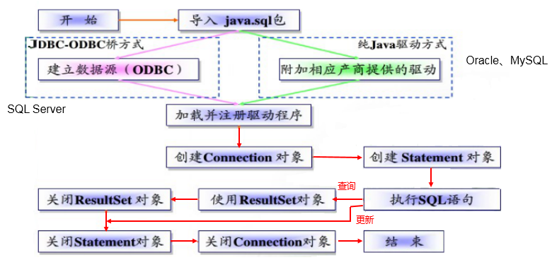
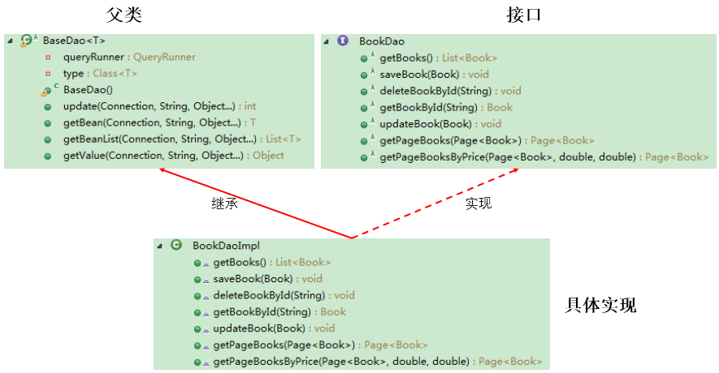

# 基础

## 数据库介绍

略

## Java连接数据库

### 方法

- **JDBC**直接访问数据库
- JDO (Java Data Object )技术

- **第三方O/R工具**，如Hibernate, Mybatis 等

### JDBC模型


### JDBC接口

- **面向应用的API**：Java API，抽象接口，供应用程序开发人员使用（连接数据库，执行SQL语句，获得结果）。
- **面向数据库的API**：Java Driver API，供开发商开发数据库驱动程序用。

### JDBC使用



# 使用JDBC

## 获取连接

### 必要之驱动

#### Driver实现类

- java.sql.Driver 接口是所有 JDBC 驱动程序需要实现的接口。这个接口是提供给数据库厂商使用的，不同数据库厂商提供不同的实现。
- 在程序中不需要直接去访问实现了 Driver 接口的类，而是由驱动程序管理器类(java.sql.DriverManager)去调用这些Driver实现。
  - Oracle的驱动：**oracle.jdbc.driver.OracleDriver**
  - mySql的驱动： **com.mysql.jdbc.Driver**

####  加载与注册驱动

- 加载驱动：加载 JDBC 驱动需调用 Class 类的静态方法 forName()，向其传递要加载的 JDBC 驱动的类名

  - **Class.forName(“com.mysql.jdbc.Driver”);**

- 注册驱动：DriverManager 类是驱动程序管理器类，负责管理驱动程序
  - **使用DriverManager.registerDriver(com.mysql.jdbc.Driver)来注册驱动**

  - 通常不用显式调用 DriverManager 类的 registerDriver() 方法来注册驱动程序类的实例，因为 Driver 接口的驱动程序类**都**包含了静态代码块，在这个静态代码块中，会调用 DriverManager.registerDriver() 方法来注册自身的一个实例。

### 必要之连接信息

URL、用户名和密码


### 连接

```Java
public  void testConnection() throws Exception {
	//1.加载配置文件
    InputStream is = ConnectionTest.class.getClassLoader().getResourceAsStream("jdbc.properties");
    Properties pros = new Properties();
    pros.load(is);
    
    //2.读取配置信息
    String user = pros.getProperty("user");
    String password = pros.getProperty("password");
    String url = pros.getProperty("url");
    String driverClass = pros.getProperty("driverClass");

    //3.加载驱动
    Class.forName(driverClass);

    //4.获取连接
    Connection conn = DriverManager.getConnection(url,user,password);
    System.out.println(conn);
}
```

```properties
user=root
password=abc123
url=jdbc:mysql://localhost:3306/test
driverClass=com.mysql.jdbc.Driver
```

## CRUD操作

- 数据库连接被用于向数据库服务器发送命令和 SQL 语句，并接受数据库服务器返回的结果。其实一个数据库连接就是一个Socket连接。
- 在 java.sql 包中有 3 个接口分别定义了对数据库的调用的不同方式：
  - Statement：用于执行静态 SQL 语句并返回它所生成结果的对象。 
  - PrepatedStatement：SQL 语句被预编译并存储在此对象中，可以使用此对象多次高效地执行该语句。
  - CallableStatement：用于执行 SQL 存储过程

Statement存在的问题

- **问题一：存在拼串操作，繁琐**

- **问题二：存在SQL注入问题**

- ```Java
  // SELECT user,password FROM user_table WHERE USER = '1' or ' AND PASSWORD = '='1' or '1' = '1';
  String sql = "SELECT user,password FROM user_table WHERE USER = '" + userName + "' AND PASSWORD = '" + password
  ```

故 PreparedStatement 替代 Statement


## 代码实现

```Java
//通用的增、删、改操作（体现一：增、删、改 ； 体现二：针对于不同的表）
public void update(String sql,Object ... args){
    Connection con = null;
    PreparedStatement ps = null;
    try {
        //1.获取数据库的连接
        con = JDBCutils.getConnection();
        //2.获取PreparedStatement的实例 (或：预编译sql语句)
        ps = con.prepareStatement(sql);
        //3.填充占位符
        for (int i = 0; i < args.length; i++) {
            ps.setObject(i+1,args[i]);
        }
        //4.执行sql语句
        return ps.executeUpdate();
    } catch (Exception e) {
        e.printStackTrace();
    }finally {
        //5.关闭资源
        JDBCutils.closeResoures(con,ps);
    }
    return 0;
}
```

```Java
// 通用的针对于不同表的查询:返回一个对象
public static <T> List<T> getList(Class<T> cla , String sql, Object ...args){
    Connection con = null;
    PreparedStatement ps = null;
    ResultSet rs = null;
    ArrayList<T> list = new ArrayList<T>();
    try {
        // 1.获取数据库连接
        con = JDBCutils.getConnection();
        // 2.预编译sql语句，得到PreparedStatement对象
        ps = con.prepareStatement(sql);
        // 3.填充占位符
        for (int i = 0; i < args.length; i++) {
            ps.setObject(i+1,args[i]);
        }
        // 4.执行executeQuery(),得到结果集：ResultSet
        rs = ps.executeQuery();
        // 5.得到结果集的元数据：ResultSetMetaData
        ResultSetMetaData rsmd = rs.getMetaData();
        // 6.1通过ResultSetMetaData得到columnCount,columnLabel；通过ResultSet得到列值
        int columnCount = rsmd.getColumnCount();
        while (rs.next()){
            T t = cla.newInstance();
            // 遍历每一个列
            for (int i = 0; i < columnCount; i++) {
                Object value = rs.getObject(i+1);
                // 获取列值
                String columnName = rsmd.getColumnLabel(i+1);
                // 获取列的别名:列的别名，使用类的属性名充当
                Field field = cla.getDeclaredField(columnName);
                // 6.2使用反射，给对象的相应属性赋值
                field.setAccessible(true);
                field.set(t,value);
            }
            list.add(t);
        }
    } catch (Exception e) {
        e.printStackTrace();
    }finally {
        // 7.关闭资源
        JDBCutils.closeResoures(con,ps,rs);
    }
    return list;
}
```

```Java
//JDBCutils
public static Connection getConnection() throws Exception{
    InputStream is = ClassLoader.getSystemClassLoader().getResourceAsStream("jdbc.properties");
    Properties pro = new Properties();
    pro.load(is);

    String user = pro.getProperty("user");
    String pwd = pro.getProperty("password");
    String driverClass = pro.getProperty("driverClass");
    String url = pro.getProperty("url");

    Class.forName(driverClass);

    Connection con = DriverManager.getConnection(url,user,pwd);
    return con;
}
public static void closeResoures(Connection con,Statement ps){
    try {
        if(ps != null)
            ps.close();
    } catch (SQLException e) {
        e.printStackTrace();
    }
    try {
        if(con != null)
            con.close();
    } catch (SQLException e) {
        e.printStackTrace();
    }
}
public static void closeResoures(Connection con,Statement ps,ResultSet rs){
    closeResoures(con,ps);
    try {
        if (rs != null){
            rs.close();
        }
    } catch (SQLException e) {
        e.printStackTrace();
    }
}
```

## 小结

- 两种思想

  - 面向接口编程的思想

  - ORM思想(object relational mapping)
    - 一个数据表对应一个java类
    - 表中的一条记录对应java类的一个对象
    - 表中的一个字段对应java类的一个属性

  > sql是需要结合列名和表的属性名来写。注意起别名。

- 两种技术

  - JDBC结果集的元数据：ResultSetMetaData
    - 获取列数：getColumnCount()
    - 获取列的别名：getColumnLabel()
  - 通过反射，创建指定类的对象，获取指定的属性并赋值

# BLOB类型操作

## BLOB类型

- MySQL中，BLOB是一个二进制大型对象，是一个可以存储大量数据的容器，它能容纳不同大小的数据。
- 插入BLOB类型的数据必须使用PreparedStatement，因为BLOB类型的数据无法使用字符串拼接写的。

- MySQL的四种BLOB类型(除了在存储的最大信息量上不同外，他们是等同的)


- 实际使用中根据需要存入的数据大小定义不同的BLOB类型。
- 需要注意的是：如果存储的文件过大，数据库的性能会下降。
- 如果在指定了相关的Blob类型以后，还报错：xxx too large，那么在mysql的安装目录下，找my.ini文件加上如下的配置参数： **max_allowed_packet=16M**。同时注意：修改了my.ini文件之后，需要重新启动mysql服务。

## 增删改

```Java
Connection conn = JDBCUtils.getConnection();
String sql = "update customers set photo = ? where id = ?";
PreparedStatement ps = conn.prepareStatement(sql);

// 填充占位符
// 操作Blob类型的变量
FileInputStream fis = new FileInputStream("coffee.png");
ps.setBlob(1, fis);
ps.setInt(2, 25);
ps.execute();
fis.close();
JDBCUtils.closeResoures(conn, ps);
```

## 查

```Java
String sql = "SELECT id, name, photo FROM customer WHERE id = ?";
conn = getConnection();
ps = conn.prepareStatement(sql);
ps.setInt(1, 8);
rs = ps.executeQuery();
if(rs.next()){
	Integer id = rs.getInt(1);
    String name = rs.getString(2);
    Date birth = rs.getDate(3);
	Customer cust = new Customer(id, name, email, birth);
    System.out.println(cust); 
    //读取Blob类型的字段
	Blob photo = rs.getBlob(3);
	InputStream is = photo.getBinaryStream();
	OutputStream os = new FileOutputStream("c.jpg");
	byte [] buffer = new byte[1024];
	int len = 0;
	while((len = is.read(buffer)) != -1){
		os.write(buffer, 0, len);
	}
    JDBCUtils.closeResoures(conn, ps, rs);

	if(is != null){
		is.close();
	}
	if(os !=  null){
		os.close();
	}
}
```

# 批量插入

当需要成批插入或者更新记录时，可以采用Java的批量**更新**机制，这一机制允许多条语句一次性提交给数据库批量处理。通常情况下比单独提交处理更有效率

JDBC的批量处理语句包括下面三个方法：

- **addBatch(String)：添加需要批量处理的SQL语句或是参数；**
- **executeBatch()：执行批量处理语句；**
- **clearBatch():清空缓存的数据**

通常我们会遇到两种批量执行SQL语句的情况：

- 多条SQL语句的批量处理；
- 一个SQL语句的批量传参；

```Java
/*
* 层次四：在层次三的基础上操作
* 使用Connection 的 setAutoCommit(false)  /  commit()
*/
@Test
public void testInsert2() throws Exception{
	long start = System.currentTimeMillis();
		
	Connection conn = JDBCUtils.getConnection();
		
	//1.设置为不自动提交数据
	conn.setAutoCommit(false);
		
	String sql = "insert into goods(name)values(?)";
	PreparedStatement ps = conn.prepareStatement(sql);
		
	for(int i = 1;i <= 1000000;i++){
		ps.setString(1, "name_" + i);
			
		//1.“攒”sql
		ps.addBatch();
			
		if(i % 500 == 0){
			//2.执行
			ps.executeBatch();
			//3.清空
			ps.clearBatch();
		}
	}
		
	//2.提交数据
	conn.commit();
		
	long end = System.currentTimeMillis();
	System.out.println("花费的时间为：" + (end - start));//1000000条:4978 
		
	JDBCUtils.closeResource(conn, ps);
}
```

# 数据库事务

## 事务处理

**事务：一组逻辑操作单元,使数据从一种状态变换到另一种状态。**

​			这一组逻辑操作被视为一个原子，不可分割。即要不所有语句执行成功，要不等于不执行。

## 数据提交

- 数据一旦提交，就不可回滚。
- 数据什么时候意味着提交？
  - **当一个连接对象被创建时，默认情况下是自动提交事务**：每次执行一个 SQL 语句时，如果执行成功，就会向数据库自动提交，而不能回滚。
  - **关闭数据库连接，数据就会自动的提交。**如果多个操作，每个操作使用的是自己单独的连接，则无法保证事务。即同一个事务的多个操作必须在同一个连接下。
- **JDBC程序中为了让多个 SQL 语句作为一个事务执行：**
  - 调用 Connection 对象的 **setAutoCommit(false);** 以取消自动提交事务
  - 在所有的 SQL 语句都成功执行后，调用 **commit();** 方法提交事务
  - 在出现异常时，调用 **rollback();** 方法回滚事务

## 事务的ACID属性

1. **原子性（Atomicity）**
   原子性是指事务是一个不可分割的工作单位，事务中的操作要么都发生，要么都不发生。 
2. **一致性（Consistency）**
   事务必须使数据库从一个一致性状态变换到另外一个一致性状态。
3. **隔离性（Isolation）**
   事务的隔离性是指一个事务的执行不能被其他事务干扰，即一个事务内部的操作及使用的数据对并发的其他事务是隔离的，并发执行的各个事务之间不能互相干扰。
4. **持久性（Durability）**
   持久性是指一个事务一旦被提交，它对数据库中数据的改变就是永久性的，接下来的其他操作和数据库故障不应该对其有任何影响。

## 数据库的并发问题

- 对于同时运行的多个事务, 当这些事务访问数据库中相同的数据时, 如果没有采取必要的隔离机制, 就会导致各种并发问题:
  - **脏读**: 对于两个事务 T1, T2, T1 读取了已经被 T2 更新但还**没有被提交**的字段。之后, 若 T2 回滚, T1读取的内容就是临时且无效的。
  - **不可重复读**: 对于两个事务T1, T2, T1 读取了一个字段, 然后 T2 **更新**了该字段。之后, T1再次读取同一个字段, 值就不同了。
  - **幻读**: 对于两个事务T1, T2, T1 从一个表中读取了一个字段, 然后 T2 在该表中**插入**了一些新的行。之后, 如果 T1 再次读取同一个表, 就会多出几行。
- **数据库事务的隔离性**: 数据库系统必须具有隔离并发运行各个事务的能力, 使它们不会相互影响, 避免各种并发问题。
- 一个事务与其他事务隔离的程度称为隔离级别。数据库规定了多种事务隔离级别, 不同隔离级别对应不同的干扰程度, **隔离级别越高, 数据一致性就越好, 但并发性越弱。**

## 四种隔离级别

- 数据库提供的4种事务隔离级别：

  

- Oracle 支持的 2 种事务隔离级别：**READ COMMITED**, SERIALIZABLE。 Oracle 默认的事务隔离级别为: **READ COMMITED** 。


- Mysql 支持 4 种事务隔离级别。Mysql 默认的事务隔离级别为: **REPEATABLE READ。**

```mysql
# 查看当前的隔离级别: 
SELECT @@tx_isolation;

# 设置当前 mySQL 连接的隔离级别:  
set  transaction isolation level read committed;

# 设置数据库系统的全局的隔离级别:
set global transaction isolation level read committed;

# 创建mysql数据库用户：
create user tom identified by 'abc123';

#授予通过网络方式登录的tom用户，对所有库所有表的全部权限，密码设为abc123.
grant all privileges on *.* to tom@'%'  identified by 'abc123'; 
#给tom用户使用本地命令行方式，授予atguigudb这个库下的所有表的插删改查的权限。
grant select,insert,delete,update on atguigudb.* to tom@localhost identified by 'abc123'; 
```

# 数据库连接池

【本章节学习重点是，如何自己找开源包，自己看文档学习并使用】

## 连接池的必要性

传统数据库连接中

- **每次向数据库建立连接的时候都会消耗资源和时间，量大尤为明显。**
- **对于每一次数据库连接，使用完后都得断开。**未能关闭将会导致数据库系统中的内存泄漏，最终导致重启数据库。
- **这种开发不能控制被创建的连接对象数**，系统资源会被毫无顾及的分配出去，如连接过多，也可能导致内存泄漏，服务器崩溃。

## 基本思想

为数据库连接建立一个“缓冲池”。预先在缓冲池中放入一定数量的连接，当需要建立数据库连接时，只需从“缓冲池”中取出一个，使用完毕之后再放回去。（联系多线程去理解）

**数据库连接池**负责分配、管理和释放数据库连接，它**允许应用程序重复使用一个现有的数据库连接，而不是重新建立一个**。

## 多种数据库连接池

- **DBCP** 是Apache提供的数据库连接池。tomcat 服务器自带dbcp数据库连接池。**速度相对c3p0较快**，但因自身存在BUG，Hibernate3已不再提供支持。
- **C3P0** 是一个开源组织提供的一个数据库连接池，**速度相对较慢，稳定性还可以。**hibernate官方推荐使用
- **Druid** 是阿里提供的数据库连接池，据说集DBCP 、C3P0 、Proxool 优点于一身，但是速度不确定是否有BoneCP快

**DataSource用来取代DriverManager来获取Connection，获取速度快，同时可以大幅度提高数据库访问速度。**

数据源和数据库连接不同，数据源无需创建多个，它是产生数据库连接的工厂

## 使用C3P0

```Java
//使用C3P0数据库连接池的配置文件方式，获取数据库的连接：推荐
private static DataSource cpds = new ComboPooledDataSource("helloc3p0");
public static Connection getConnection2() throws SQLException{
	Connection conn = cpds.getConnection();
	return conn;
}
```

```xml
<?xml version="1.0" encoding="UTF-8"?>
<c3p0-config>
	<named-config name="helloc3p0">
		<!-- 获取连接的4个基本信息 -->
		<property name="user">root</property>
		<property name="password">abc123</property>
		<property name="jdbcUrl">jdbc:mysql:///test</property>
		<property name="driverClass">com.mysql.jdbc.Driver</property>
		
		<!-- 涉及到数据库连接池的管理的相关属性的设置 -->
		<!-- 若数据库中连接数不足时, 一次向数据库服务器申请多少个连接 -->
		<property name="acquireIncrement">5</property>
		<!-- 初始化数据库连接池时连接的数量 -->
		<property name="initialPoolSize">5</property>
		<!-- 数据库连接池中的最小的数据库连接数 -->
		<property name="minPoolSize">5</property>
		<!-- 数据库连接池中的最大的数据库连接数 -->
		<property name="maxPoolSize">10</property>
		<!-- C3P0 数据库连接池可以维护的 Statement 的个数 -->
		<property name="maxStatements">20</property>
		<!-- 每个连接同时可以使用的 Statement 对象的个数 -->
		<property name="maxStatementsPerConnection">5</property>
	</named-config>
</c3p0-config>
```

## 使用DBCP

```Java
//使用dbcp数据库连接池的配置文件方式，获取数据库的连接：推荐
private static DataSource source = null;
static{
	try {
		Properties pros = new Properties();
		
		InputStream is = DBCPTest.class.getClassLoader().getResourceAsStream("dbcp.properties");
			
		pros.load(is);
		//根据提供的BasicDataSourceFactory创建对应的DataSource对象
		source = BasicDataSourceFactory.createDataSource(pros);
	} catch (Exception e) {
		e.printStackTrace();
	}
		
}
public static Connection getConnection4() throws Exception {
		
	Connection conn = source.getConnection();
	
	return conn;
}
```

```properties
driverClassName=com.mysql.jdbc.Driver
url=jdbc:mysql://localhost:3306/test?rewriteBatchedStatements=true&useServerPrepStmts=false
username=root
password=abc123

initialSize=10
#...
```

## 使用Druid

```java
public class TestDruid {
	public static void main(String[] args) throws Exception {
		Properties pro = new Properties();		 pro.load(TestDruid.class.getClassLoader().getResourceAsStream("druid.properties"));
		DataSource ds = DruidDataSourceFactory.createDataSource(pro);
		Connection conn = ds.getConnection();
		System.out.println(conn);
	}
}
```

```properties
url=jdbc:mysql://localhost:3306/test?rewriteBatchedStatements=true
username=root
password=123456
driverClassName=com.mysql.jdbc.Driver

initialSize=10
maxActive=20
maxWait=1000
filters=wall
```

# DAO设计思路

DAO(Data Access Object)：访问数据信息的类和接口，包括了对数据的CRUD（Create、Retrival、Update、Delete）

一张表对应一个对象，一个对象要写CURD接口以及接口实现。

一个BASE_DAO，常用的方法实现




# Apache-DBUtils

commons-dbutils 是 Apache 组织提供的一个开源 JDBC工具类库，它是对JDBC的简单封装，学习成本极低，并且使用dbutils能极大简化jdbc编码的工作量，同时也不会影响程序的性能。

API介绍：

- org.apache.commons.dbutils.QueryRunner
- org.apache.commons.dbutils.ResultSetHandler
- 工具类：org.apache.commons.dbutils.DbUtils   

## QueryRunner类

- **该类简单化了SQL查询，它与ResultSetHandler组合在一起使用可以完成大部分的数据库操作，能够大大减少编码量。**
- QueryRunner类提供了两个构造器：
  - 默认的构造器
  - 需要一个 javax.sql.DataSource 来作参数的构造器
- QueryRunner类的主要方法：
  - **更新**
    - public int update(Connection conn, String sql, Object... params) throws SQLException:用来执行一个更新（插入、更新或删除）操作。
  - **插入**
    - public <T> T insert(Connection conn,String sql,ResultSetHandler<T> rsh, Object... params) throws SQLException：只支持INSERT语句，其中 rsh - The handler used to create the result object from the ResultSet of auto-generated keys.  返回值: An object generated by the handler.即自动生成的键值
  - **批处理**
    - public int[] batch(Connection conn,String sql,Object[][] params)throws SQLException： INSERT, UPDATE, or DELETE语句
    - public <T> T insertBatch(Connection conn,String sql,ResultSetHandler<T> rsh,Object[][] params)throws SQLException：只支持INSERT语句
  - **查询**
    - public Object query(Connection conn, String sql, ResultSetHandler rsh,Object... params) throws SQLException：执行一个查询操作，在这个查询中，对象数组中的每个元素值被用来作为查询语句的置换参数。该方法会自行处理 PreparedStatement 和 ResultSet 的创建和关闭。

## ResultSetHandler

- 该接口用于处理 java.sql.ResultSet，将数据按要求转换为另一种形式。

- ResultSetHandler 接口提供了一个单独的方法：Object handle (java.sql.ResultSet .rs)。

- 接口的主要实现类：

  - ArrayHandler：把结果集中的第一行数据转成对象数组。
  - ArrayListHandler：把结果集中的每一行数据都转成一个数组，再存放到List中。
  - **BeanHandler：**将结果集中的第一行数据封装到一个对应的JavaBean实例中。
  - **BeanListHandler：**将结果集中的每一行数据都封装到一个对应的JavaBean实例中，存放到List里。
  - ColumnListHandler：将结果集中某一列的数据存放到List中。
  - KeyedHandler(name)：将结果集中的每一行数据都封装到一个Map里，再把这些map再存到一个map里，其key为指定的key。
  - **MapHandler：**将结果集中的第一行数据封装到一个Map里，key是列名，value就是对应的值。
  - **MapListHandler：**将结果集中的每一行数据都封装到一个Map里，然后再存放到List
  - **ScalarHandler：**查询单个值对象

# 总结