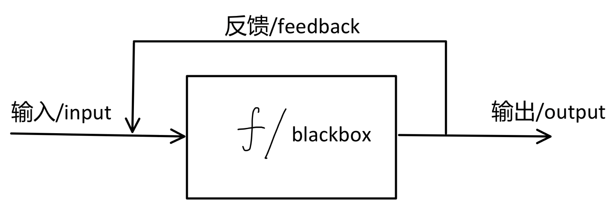

# 零基础必读

每个人都是从零基础过来的。不过有的人接触早，从小到大一直在用PC，所以初学阶段的痛苦小一点，甚至无感。

零基础的痛苦在于没有方向，没有指导，一堆概念和各种问题涌入一时无法理解、分门别类和解决。

本文的目标就在于尝试回忆和挖掘出已经深化为习惯，不自知的一些关键细节。帮助初学者掌握重点，减少入门痛苦。

本文假定读者为office都不会安装，甚至不知道office是啥的人。

## 学习经验

### 一、学习方法

对于大多数人来说，任何的学习过程可以用如下公式概括：**理解+熟练**

**【理解**】可以通过如下公式：**what、why、How** + 案例/应用

- what：这个东西是什么（概念）
- why：为什么要用这个东西（作用、意义）。
- how：这个东西内部是怎么工作的（原理、用法）。

由于人的大脑能力有限，我们需要对很多事物进行一定程度的化简，这样我们才能过得开心轻松。所以很多东西内部的原理都被屏蔽了，常常我们仅需要知道一个概念和用法即可（这也是为什么人容易被糊弄、容易错用概念）。

以货币为例，很多人并不知道货币背后的经济学原理、信用、货币的发源，但是知道手里的RMB可以买到自己想要的东西（前提是够）。

学习过程中，根据个人能力、所处情景适度进行how的追寻，不然你会陷入沼泽之中无法出来。

理解过程也是对大脑里的已有知识的应用、修补、更新、增添。这样才能构建一个灵活、自洽的知识体系。

如果你理解起来很费劲，一般不是你不够聪慧，而是铺垫的知识掌握不牢导致的。这个时候该怎么做我想你也知道了。学习是个积累的过程。

**【熟练**】：反复练习，使用（刷题，不得已可以背诵）。

### 二、学习资料

what：一个好的老师、书籍、教程极其重要。

why：

- 提高你的学习兴趣，让你有动力学习、进入沉浸状态。
- 有重点、有逻辑、有体系。告诉你来龙去脉（也就是what、why、How），进行旁征博引（也就是案例/应用）

【不知道被国内垃圾教材折磨、遇到老师自己都不是很懂就敢给你上课的人，有没有同感】

how：（可能不限于计算机领域）

- 善用Google、github、[stackoverflow](https://stackoverflow.com/)
- 官方文档、推荐的国外原版书籍
- 学好英语，用英语搜索、阅读

### 三、心路历程

## 小白常见问题

### 问题一：数学

Q：学计算机用不用学数学，数学不好可以学计算机吗，

A：现代的科技成果都是建立在数学物理的基础之上的，数学当然很重要。但正如前文提到的，你只需要知道概念也可。但是也注定了你在某个领域内走不远。不过，你不做研究，我想高中数学基础也够应对大部分场景。很多人问这个问题是出于"**既要也要**"的心理，但是"**有舍有得**"。我的个人建议是，先解决最要紧的事情，如果你着急就业就先放一边，但是日后一定要补起来。

### 问题二：英语

Q：不会英语/英语不好可以学嘛？

A：遇上一个问题异曲同工，"**既要也要**"。

​	我先说说英语的重要性吧。①计算机技术完全是舶来品，源自英语世界，所以很多最新最先进的技术都是以英语为主要语言发布的。这也是为什么之前学习资料里说了，推荐用国外原版教材（及时、国内翻译一言难尽）。②编程过程中不可避免的碰到各种问题、要用的很多工具都是英文的。③英语好的话会极大帮助你理解一些概念，也有更优质且丰富的资源等你学习。

​	对基础很差的，初学时的个人建议：①就从单词积累开始，多敲多看几遍就记住了。②有汉化也不要用，杜绝依赖！③适当借助Google翻译。

​	最终还是要掌握这门语言，语言也是工具，够用即可。

### 问题三：选择哪门语言

### 问题四：coming soon

## 计算机基础知识

该部分内容可以帮助你更容易理解后续只是，有助于学习理解。

### 计算机硬件组成

在计算机世界里，并没有魔法。

在谈计算机原理之前我先来说一个通用模型，借用自控制理论里的概念。

①输入和输出的都是数据（或者信息、随便什么都行）

②f或者blackBox：一个抽象函数或者黑箱。黑箱就是你不知道内部的工作原理。

③反馈：对将输出作用于输入，形成一个闭环。

【应用】

当blackBox为人脑时，这个f是会因为输入变化的。这个模型可以用来表示人的学习过程。我经常用这个来解释洗脑和信息茧房。

- 洗脑：通过给你塞入一堆垃圾数据，改变你的f，让你变弱智。
- 信息茧房：feedback出了问题，你反馈什么越给你推荐什么。

现在，我们把f看作是计算机。计算机原理学得就是这个f，不过这个f内部的工作原理特别简单：判断真假。由于实现方式，我们用0和1代替。所以f所做的一切事情都是逻辑操作或者传递数据。逻辑操作有与或非，可以自行查询或以后课程也会涉及。

具体实现，f就是常说的CPU。我们有了cpu，也得有存放数据的环境，这就是硬盘和内存。硬盘里的数据没电了还在，但是硬盘速度慢。内存里的数据没电了就没了，但是速度快。因为现在的cpu运算速度很快，数据读写反而成为瓶颈，所以需要用内存来辅助硬盘。假如硬盘速度无限快，我们也就用不到内存了。运行一个程序的流程就是从硬盘读取数据到内存，内存再到CPU进行处理（也就是上述这个模型），处理之后的数据写入内存，要是需要长时间保存则就写入硬盘里（这也是保存按钮所做的事情，写入到硬盘里，持久保存）。

显卡：显卡核心组成就是GPU，所以显卡约等于GPU。至于GPU，和CPU类似，也是一种做运算的芯片。不过因为底层设计，GPU更善于图形方面的计算。

网卡、声卡等等：完成专门功能的硬件部分，网卡用来上网的，声卡用来音频处理的。

以上所有的部件都需要集成在一起，才能配合工作，这就是主板。

哦，别忘了，他们都得通电，所以你需要一个电源，来给他们分配电。

### 什么是操作系统

### 什么是算法和数据结构

### 什么是计算机网络

## 作为程序员必会

以下内容可以不用专门去学习，遇到了去查、去用即可。

该部分内容需要花长时间去练习、熟练。

### 盲打

标准指法，常年练习

### 翻墙

### git

### github

### markdown

### Linux

体会命令行这种人机交互方式的魅力，也就是效率！

cmd、shell

### 正则表达式

### IDE

vim、IDEA、eclipse

### LaTeX

写一些论文必备，可忽略

## 奇技淫巧

### 重装系统

### 虚拟机

## 开发环境搭建
